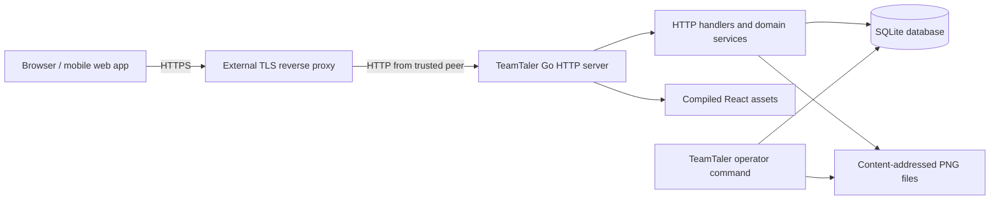

# TeamTaler Architecture

## System overview

TeamTaler is a self-hosted group expense and settlement application implemented as a modular monolith. One Go process serves the versioned JSON API and the compiled React single-page application. The same process owns authentication, authorization, domain transactions, SQLite access, image delivery, health endpoints, and request logging.

Production uses one TeamTaler application replica, one SQLite database on a local filesystem, and content-addressed product images below the application data directory. An external reverse proxy terminates TLS. The `teamtaler` binary also provides operator commands that open the same local database or data directory directly.



This topology deliberately avoids a separate application server, database server, cache, queue, or object store. It is suitable for a small server but does not support horizontal application replicas.

## Repository and module structure

### Process entry point

- `cmd/teamtaler` selects the `serve`, `version`, `healthcheck`, `admin bootstrap`, `backup create`, or `restore` command. The server applies configuration and migrations before accepting traffic and shuts down on `SIGINT` or `SIGTERM`.

### Backend packages

- `internal/auth` implements Argon2id password hashing, first-run bootstrap, login, invitation acceptance, opaque server-side sessions, logout, and expired-session cleanup.
- `internal/groups` implements group creation, tenant membership lookup, member listing, cumulative roles, category grants, permission replacement, and seven-day invitation creation/listing.
- `internal/catalog` implements category and product reads and writes, idempotent product creation, optimistic versions, catalog authorization, image validation, PNG normalization, and content-addressed image paths.
- `internal/bookings` implements idempotent booking creation, immutable product/category/price snapshots, third-party assignment rules, 30-second standard self-undo, audited reversal, and booking visibility.
- `internal/finance` implements consolidated member accounts, personal and anonymous group category statistics, incoming payments, payment reversal, recent ledger activity, and finance-manager read models.
- `internal/ledger` rebuilds correction and payment allocations. Negative current-period corrections offset the oldest positive claims before non-reversed payments are allocated oldest first.
- `internal/periods` lists periods, closes the current period, snapshots member statements, opens the successor period, and returns settlement status enriched with later allocations.
- `internal/notifications` lists member notifications and changes their read state.
- `internal/audit` writes and lists group-scoped audit events.
- `internal/idempotency` validates keys and stores or replays mutation results.
- `internal/backup` creates consistent checksummed archives and validates/restores them.
- `internal/httpapi` registers routes and composes authentication, CSRF, origin, body-limit, security-header, request-log, recovery, and SPA middleware around the services.
- `internal/config` loads and validates `TEAMTALER_*` process configuration.
- `internal/storage` configures SQLite, applies embedded forward-only migrations, rejects unknown future migrations, and provides transaction helpers.
- `internal/domain` defines shared roles, permissions, entities, and transport-safe error classes.
- `internal/platform` provides random identifiers, random secrets, secret hashes, timestamps, and the process clock.

The packages are internal implementation boundaries, not separately deployable services. Transaction-owning services call SQL directly through `database/sql`; there is no repository abstraction or runtime dependency-injection container.

### Schema and API

- `migrations` embeds forward-only SQL migrations into the Go binary.
- `api/openapi.yaml` documents the HTTP API contract. The Go handlers and service types remain the executable source of truth and must be kept synchronized with it.

### Frontend

- `web/src/app` owns the TanStack Router tree, query provider, active-group context, and top-level not-found handling.
- `web/src/components` contains layout, navigation, brand, and reusable form/modal/state primitives.
- `web/src/features` contains authentication, dashboard, booking, activity, reports, account, notifications, and role-aware administration slices.
- `web/src/api` contains the same-origin fetch client, wire-model adapters, money conversion, and frontend types.
- `web/src/demo` contains an explicit in-memory development transport and sample images. Vite includes them only when `VITE_DEMO_MODE=true` in a development build; production bundles exclude both fixtures and assets.
- `web/src/i18n.ts` initializes i18next, while `web/src/locales/de.ts` centralizes reusable German interface, error, and accessibility copy.
- `web/public` contains the brand mark and bundled development-demo product images.

The frontend consumes response monetary fields as exact decimal strings and uses `BigInt` for adaptation and formatting. Currency-specific fraction digits come from `Intl.NumberFormat`, including zero- and three-decimal currencies; syntactically valid private currency codes fall back to two fraction digits. Command requests send bounded JSON integers. UI role checks decide which controls are displayed; the backend repeats every authorization decision.

## Data model

The initial schema consists of strict SQLite tables plus the migration ledger:

| Table | Responsibility |
| --- | --- |
| `schema_migrations` | Applied embedded migration filenames. |
| `users` | Global local identities and Argon2id password hashes. |
| `sessions` | Hashed session and CSRF secrets, expiry, and throttled last-seen time. |
| `groups` | Tenant name and three-letter accounting currency. |
| `memberships` | User participation and active/archive status within a group. |
| `membership_roles` | Cumulative `ADMIN`, `FINANCE_MANAGER`, and `CATALOG_MANAGER` roles. |
| `categories` | Standard or penalty category, active state, sort order, and version. |
| `category_permissions` | Per-member, per-category `ASSIGN_TO_OTHERS` and `VOID_BOOKINGS` grants. |
| `products` | Category, current name and price, optional image key, active state, sort order, and version. |
| `periods` | Exactly one open period per group plus closed interval metadata and due date. |
| `bookings` | Actor, target, quantity, immutable catalog/price snapshots, reason, and void metadata. |
| `payments` | Received money, member, method, references, and reversal metadata. |
| `payment_allocations` | Parts of non-reversed payments allocated to period claims. |
| `period_adjustment_allocations` | Negative correction value applied from one period to an older positive claim. |
| `ledger_entries` | Immutable member receivable, category revenue, and group cash movements. |
| `period_statements` | Immutable close-time member snapshots, including payment and correction fields at close. |
| `invitations` | Hashed single-use tokens, invited email, optional roles, expiry, and acceptance state. |
| `notifications` | Member-visible events and read state. |
| `audit_events` | Immutable administrative and domain action history. |
| `idempotency_results` | Request hash and serialized response for protected mutation retries. |

Tenant-bearing queries are scoped by `group_id`. Composite foreign keys protect important group-owned relationships such as membership roles, category grants, products, bookings, allocations, and ledger references. The last active administrator cannot be demoted through the permission service.

Prices and ledger amounts are persisted and calculated as signed 64-bit integer minor units. API responses serialize monetary fields as exact base-10 strings so browsers cannot lose precision above JavaScript's safe-integer limit; command inputs remain bounded JSON integers. Currency input is restricted to three uppercase ASCII letters but is not checked against an external ISO 4217 registry. A group has no time-zone or payment-instructions column in the current schema. Product images are files referenced by `products.image_key`; there is no separate image-asset table.

SQLite triggers prevent update/delete of `ledger_entries`, `period_statements`, and `audit_events`, and prevent further updates to already closed `periods`. The service layer writes paired accounting entries in one transaction and integration tests verify balance for booking flows. The database schema does not implement a separate transaction/posting journal or a trigger that independently proves every set of ledger entries balances.

## Authorization model

An authenticated user first resolves an active membership for the group in the request path.

- `ADMIN` implies all group-level roles and all category permissions.
- `FINANCE_MANAGER` can inspect other member accounts, list all bookings, manage payments, list settlements for all members, and close periods.
- `CATALOG_MANAGER` can create/update categories and products and assign product images.
- `ASSIGN_TO_OTHERS` permits a member to book a product from one category to another active member.
- `VOID_BOOKINGS` permits reasoned reversal of a booking from one category.
- A regular member sees the group member directory, bookings they created or that target them, their own account/statements, anonymous group category aggregates, and their own notifications.
- Only an administrator can replace roles/category grants or read the audit feed.

A standard self-booking made for the same membership may be undone for 30 seconds without the category reversal grant. Other reversals require the grant and a reason. Assigning a penalty to another member requires both the assignment grant and a reason.

## Data flow

### Session-authenticated request

1. The HTTP layer limits the request body and attaches a request identifier.
2. A hashed session-cookie lookup resolves the global user.
3. Non-safe methods validate the exact configured browser origin and compare the `X-CSRF-Token` header with the session-bound CSRF token.
4. A group handler resolves the active membership for the path's `groupID`.
5. The domain service reloads group-owned resources and applies role, category, state, and version checks.
6. A transaction persists the command, accounting effects, notifications, audit event, and idempotency result where applicable.
7. The HTTP layer returns JSON or RFC 9457-shaped Problem Details.

### Booking

```mermaid
sequenceDiagram
    participant UI as React UI
    participant HTTP as HTTP middleware/handler
    participant Booking as Booking service
    participant DB as SQLite transaction
    UI->>HTTP: POST booking + Idempotency-Key
    HTTP->>Booking: Principal, membership, command
    Booking->>DB: Load active product, category, open period
    Booking->>DB: Validate product version, expected period, target, grant
    Booking->>DB: Insert booking snapshot and paired ledger entries
    Booking->>DB: Rebuild allocations; write notification/audit/idempotency
    DB-->>Booking: Commit
    Booking-->>UI: Created or replayed booking
```

The server calculates the total from the current persisted price and requested quantity. A stale product version or stale expected period produces a precondition failure. Third-party targets receive a notification.

Every booking snapshot stores both `actor_membership_id` and `target_membership_id`. The activity UI resolves, displays, and searches both identities for every booking, while dashboard activity adds an explicit actor cue when the actor and target differ.

Booking reversal marks the original booking voided and inserts linked counter-entries in the currently open period. This keeps closed period ledger entries unchanged while representing the correction in current accounting. Allocations are rebuilt for the affected member.

### Payment and allocation

A finance manager records a positive payment. The transaction inserts the payment, a negative member-receivable entry, a positive group-cash entry, a member notification, an audit event, and an idempotency response.

`ledger.RebuildPaymentAllocations` derives claims from non-payment member-receivable entries by period:

1. Negative period corrections offset the oldest remaining positive period claims.
2. Non-reversed payments are applied in received-time order to the oldest remaining positive claims.
3. Unallocated payment value remains visible as member credit in the consolidated ledger balance and is available when later claims are rebuilt.

Payment reversal marks the payment reversed, adds linked counter-entries in the current open period, and rebuilds allocations. The original payment and its audit history remain present.

### Period close and statements

A finance manager supplies the final label, due date, and optional successor label. One transaction closes the only open period, rebuilds every member's allocations, inserts an immutable `period_statements` row and notification for every membership, opens a successor period, writes an audit event, and stores the idempotent result.

Statement rows preserve close-time identity and accounting fields. Statement reads recalculate payment and correction allocations from current allocation tables so later payments or reversals update the displayed `OPEN`, `PARTIAL`, `PAID`, or `CREDIT` status without modifying the snapshot row.

### Image upload

The handler resolves the authenticated group membership, catalog role, and product before parsing image data. The image module then:

1. Limits raw input to 5 MiB.
2. Accepts decoded JPEG, PNG, or WebP only.
3. Rejects dimensions above 4096 pixels per side or 8 million total pixels.
4. Decodes and re-encodes one PNG, stripping source metadata.
5. Rejects a normalized PNG larger than 10 MiB.
6. Names the file with the SHA-256 digest of normalized content and publishes it with a rename.
7. Stores the key on the product in an audited transaction.

The current implementation does not apply EXIF orientation or generate responsive variants. It also does not delete replaced content hashes during an online request because a concurrent transaction could begin referencing the same hash. Such stale files remain local until deliberate offline maintenance, but backup archives include only hashes referenced by their database snapshot.

## HTTP interfaces

- API routes are rooted at `/api/v1`; liveness and readiness are `/health/live` and `/health/ready`.
- API and SPA use one origin. There is no CORS configuration.
- Product creation, booking creation/reversal, payment creation/reversal, and period close require an `Idempotency-Key`.
- Category and product update bodies carry a version. Optional `If-Match` is checked against that version, and successful catalog writes return a version ETag.
- The member collection returns a content-derived ETag, but permission replacement currently does not enforce `If-Match`.
- Errors use `application/problem+json` with a stable problem type, title, status, detail, and request path.
- List handlers for bookings, payments, notifications, and audit accept a bounded `limit` up to 200. Cursor pagination is not implemented.
- There are no destructive financial DELETE routes. Reversal commands preserve original records.
- Product images require an active membership in the group path and a product reference to the image in that group. Responses use `private, no-store` caching; storage remains globally content-addressed below the data directory.

The compiled SPA uses history fallback for non-API GET/HEAD routes. Hashed frontend assets receive immutable caching; `index.html` is served with `no-cache`.

## Authentication and security boundaries

- Passwords use Argon2id with random 16-byte salts, 64 MiB memory, three iterations, parallelism two, and a 32-byte result.
- Passwords are limited to 12–1024 characters.
- Session and CSRF secrets are generated randomly and stored only as SHA-256 hashes. Sessions last 30 days; last-seen writes are throttled to once per 15 minutes.
- The session cookie is HttpOnly. Session and CSRF cookies use SameSite Strict and become Secure when `TEAMTALER_PUBLIC_URL` uses HTTPS.
- Mutation requests require a matching CSRF header and, when an `Origin` header is present, the exact configured origin.
- Invitation tokens are stored as hashes, expire after seven days, and are consumed once. The generated browser URL carries the token in a fragment, and the React page sends it in the acceptance request body.
- Login attempts are limited in memory by peer IP and IP/email pair; invitation acceptance is limited by peer IP. At most two password-hash operations run concurrently. These limits reset when the single process restarts.
- Forwarded client addresses are accepted only when the immediate peer belongs to `TEAMTALER_TRUSTED_PROXY_CIDRS`.
- Security headers include a same-origin content security policy, frame denial, MIME sniffing prevention, a restrictive permissions policy, and HSTS when secure cookies are enabled.

TeamTaler does not protect its local database, image files, or backups from a fully compromised host administrator. Encryption at rest and off-host backup encryption are operator responsibilities.

## Persistence, transactions, and concurrency

SQLite is opened with foreign keys, WAL journal mode, a 5-second busy timeout, and `synchronous=FULL`. The process configures up to four open database connections and uses short service-owned write transactions.

Bootstrap, group creation, invitation acceptance, permission replacement, catalog writes, booking commands, payment commands, and period close define explicit transaction boundaries. Image decoding occurs outside a database transaction after authorization and product lookup.

Forward-only migrations run in lexical order at database open and are recorded in `schema_migrations`. Startup and restore reject migration names unknown to the running binary. Downgrade migrations are not implemented; rollback requires the older image together with a compatible pre-upgrade backup.

The restore command stages data below `TEAMTALER_DATA_DIR`, requires `TEAMTALER_DATABASE_PATH` to be a direct child of that directory, and installs the snapshot at that configured path. The direct-child constraint keeps staging, recovery, and final renames on the same mounted filesystem.

## Backup architecture

`backup create` uses SQLite `VACUUM INTO` to create a consistent snapshot. It queries that snapshot for distinct product image keys and includes only referenced files. The archive contains `teamtaler.db`, optional `images/<sha256>.png` files, and `manifest.json` with format version, creation time, and per-file SHA-256 checksums.

Restore stages extraction below the writable data directory and permits only regular files at known paths. It limits expanded content to 2 GiB and validates manifest coverage, checksums, image content addresses, SQLite integrity, foreign keys, embedded migration compatibility, and exact referenced-image coverage. With `--force`, existing database/WAL/SHM files and the image directory move to a timestamped recovery directory before installation.

## External dependencies

### Backend runtime

- The Go standard library provides HTTP, JSON, SQL interfaces, cryptographic randomness/hashes, archive handling, image codecs for JPEG/PNG, and structured key-value logging.
- `modernc.org/sqlite` provides the pure-Go SQLite driver.
- `golang.org/x/crypto` provides Argon2id.
- `golang.org/x/image` provides WebP decoding.
- `golang.org/x/term` suppresses terminal echo for the interactive bootstrap password prompt.

There is no external backend framework or router; routes use Go's `net/http` method/path patterns.

### Frontend runtime

- React 19 and React DOM render the UI.
- TanStack Query manages server state and TanStack Router defines client routes.
- React Hook Form manages authentication forms.
- i18next and react-i18next initialize localization.
- Lucide React supplies tree-shaken icons.

TypeScript, Vite, ESLint, Vitest, jsdom, and Testing Library are development/build dependencies. Go modules are pinned by `go.sum`; frontend dependencies are pinned by `web/package-lock.json`.

### Deployment dependencies

- Docker/Compose are the supported packaging path.
- A reverse proxy provides HTTPS and certificate lifecycle.
- A local filesystem persists the named volume.

TeamTaler v1 does not require SMTP, a payment provider, Redis, an external database, object storage, or a message broker.

## Deployment architecture

The Dockerfile builds the frontend with Node 24, builds a static Go binary with Go 1.26, and copies the binary, compiled web assets, CA certificates, time-zone data, and license into an Alpine runtime image. The runtime uses UID/GID 10001.

The default Compose service:

- publishes `127.0.0.1:8080` by default;
- mounts `teamtaler-data` at `/var/lib/teamtaler`;
- uses a read-only root filesystem and a bounded `/tmp` tmpfs;
- drops all Linux capabilities and enables `no-new-privileges`;
- rotates `json-file` logs;
- probes `/health/ready` through the binary's `healthcheck` command.

`/health/live` reports process availability. `/health/ready` performs a database ping; successful process startup has already opened the database and applied or validated migrations.

## Plugin and extension architecture

TeamTaler v1 has no plugin loader, extension manifest, scripting runtime, event bus, or stable third-party backend adapter interface. Accounting and authorization behavior can be extended only through reviewed source changes and database migrations.

The supported external integration boundary is the versioned same-origin HTTP API described by `api/openapi.yaml`. Additive endpoints should remain under `/api/v1` when backward compatible; incompatible contracts require a new API version.

Internal package boundaries provide places for future adapters, but current clock, identifier, storage, notification, and persistence implementations are concrete functions/services rather than interchangeable plugin interfaces. A future extension system must define failure isolation, authorization, transaction ownership, audit behavior, and compatibility before third-party code is loaded.

## Implemented test coverage

Backend Go tests currently cover:

- Argon2id hashing and password limits.
- Public URL, loopback-only HTTP, and direct-child database-path configuration validation.
- Three-uppercase-letter currency-code validation.
- rejection of unknown future migrations.
- image normalization and invalid-image rejection.
- backup creation and restore.
- Password-hash concurrency overload response shape.
- Authenticated, group-referenced image delivery.
- bootstrap/login, single-use invitation acceptance, tenant isolation, and role/category authorization.
- throttled session last-seen writes.
- booking undo, assignment validation, and paired ledger balance.
- payment FIFO, reversal, closed-period immutability, future-credit use, and negative/partial correction allocation.

Frontend Vitest tests currently cover API adapters, exact money handling for zero-, two-, and three-decimal currencies, durable scoped idempotency reservations and retry semantics, staged product/image recovery, active-product filtering, authentication and invitation behavior, acting/target booking traceability, localized ledger descriptions and plural forms, the toggle primitive, product selection, account settlement adaptation, and CSV formula neutralization. CI runs Go formatting, vet, race-enabled tests with coverage, frontend lint/tests/build/audit, and a container image build plus `teamtaler version` command smoke check.

There is currently no committed Playwright end-to-end suite, automated browser visual-regression suite, property-test suite, or dedicated security-test suite. Browser acceptance and responsive inspection are release QA activities rather than repository test jobs.
