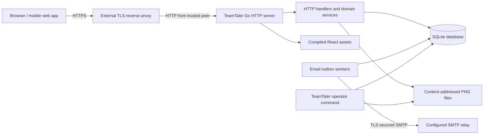

# TeamTaler Architecture

## System overview

TeamTaler is a self-hosted group expense and settlement application implemented as a modular monolith. One Go process serves the versioned JSON API and the compiled React single-page application. The same process owns authentication, authorization, domain transactions, SQLite access, image delivery, optional SMTP invitation, public-registration-verification, and notification delivery, health endpoints, and request logging.

Production uses one TeamTaler application replica, one SQLite database on a local filesystem, and content-addressed product images, group logos, and user profile images below the application data directory. An external reverse proxy terminates TLS. The `teamtaler` binary also provides operator commands that open the same local database or data directory directly.



This topology deliberately avoids a separate application server, database server, cache, queue, or object store. It is suitable for a small server but does not support horizontal application replicas.

## Repository and module structure

### Process entry point

- `cmd/teamtaler` selects the `serve`, `version`, `healthcheck`, `admin bootstrap`, `backup create`, or `restore` command. The server applies configuration and migrations, starts optional invitation-, public-registration-, and notification-email outbox workers, and shuts HTTP and worker activity down on `SIGINT` or `SIGTERM`.
- `cmd/teamtaler-testdata` is a development-only fixture builder. It composes the same authentication, group, catalog, booking, and finance services used by the HTTP server to populate an empty disposable database; production builds and container images do not include this command.

### Backend packages

- `internal/auth` implements Argon2id password hashing, first-run bootstrap, login, rate-limited secret-minimal invitation and public-link previews, public email-verified registration, invitation and public-link acceptance, archived-membership reactivation with role replacement, profile-image lifecycle, opaque server-side sessions, logout, and expired-session cleanup.
- `internal/groups` implements group creation, tenant membership lookup, permission-gated identity and behavior settings, member listing/archival, group-owned role and grant management, optimistic role assignments, versioned public join-link lifecycle, individual invitation creation/editing/revocation/resending, shared invitation deduplication, and atomic idempotent CSV invitation imports.
- `internal/authorization` centralizes permission evaluation through `Policy.Can` and transaction-compatible `Require`, unions current role grants, expands implications, and evaluates tenant-bound resource context without cross-request caching.
- `internal/memberimport` parses bounded UTF-8 comma- or semicolon-delimited invitation documents and preserves row-level validation outcomes.
- `internal/email` implements the SMTP sender boundary, mandatory STARTTLS or implicit TLS transport, localized plain-text invitation, public-registration verification, and notification rendering, and leased transactional-outbox dispatch with bounded retries.
- `internal/catalog` implements category and product reads and writes, controlled category-icon validation, fixed or user-defined pricing modes, idempotent product creation, optimistic versions, and catalog authorization.
- `internal/media` validates JPEG/PNG/WebP input, strips metadata through PNG normalization, and owns content-addressed image paths shared by group logos, product images, and user profile images.
- `internal/bookings` resolves server-authoritative fixed prices or validates actor-supplied unit prices, then implements idempotent single and atomic multi-target booking creation, immutable product/category/price snapshots, permission-gated third-party assignment, actor-based 30-second reason-free reversal, audited reversal, and activity visibility.
- `internal/finance` implements consolidated member accounts, a group-wide active/former-membership balance summary, personal and anonymous group category statistics, permission-gated group and own-account incoming payments, payment reversal, recent ledger activity, and finance-management read models.
- `internal/ledger` rebuilds correction and payment allocations. Negative current-period corrections offset the oldest positive claims before non-reversed payments are allocated oldest first.
- `internal/periods` lists periods, closes the current period, snapshots member statements, opens the successor period, and returns settlement status enriched with later allocations.
- `internal/notifications` atomically creates structured member notifications and optional email jobs, exposes exact unread summaries and cursor-backed member history, and applies tenant-scoped batch read acknowledgements.
- `internal/audit` writes and lists group-scoped audit events.
- `internal/idempotency` validates keys and stores or replays mutation results.
- `internal/backup` creates consistent checksummed archives and validates/restores them.
- `internal/httpapi` registers routes and composes authentication, CSRF, origin, body-limit, security-header, request-log, recovery, and SPA middleware around the services.
- `internal/config` loads and validates `TEAMTALER_*` process configuration.
- `internal/storage` configures SQLite, applies embedded forward-only migrations, verifies their foreign-key integrity before commit, rejects unknown future migrations, and provides transaction helpers.
- `internal/domain` defines stable permission keys, scope-aware grants, role definitions and assignments, shared entities, permission implications, and transport-safe error classes.
- `internal/platform` provides random identifiers, random secrets, secret hashes, timestamps, the process clock, shared email normalization, and AES-256-GCM invitation-token envelopes.

The packages are internal implementation boundaries, not separately deployable services. Transaction-owning services call SQL directly through `database/sql`; there is no repository abstraction or runtime dependency-injection container.

### Development test runtime

`.codex/environments/environment.toml` exposes the **Start test server** action through `make test-server`. `scripts/test-server.sh` builds the backend and fixture binaries, creates a permission-restricted temporary data directory below the ignored `tmp/test-server` path, seeds it through domain services, starts the backend on loopback port 8080, and starts Vite on loopback port 5173 with demo transport explicitly disabled. Vite proxies `/api` to the real backend. Signal handling terminates both child processes and deletes only the action-owned temporary database, so every run begins from the same logical fixture without touching operator data in `data/`.

### Schema and API

- `migrations` embeds forward-only SQL migrations into the Go binary.
- `api/openapi.yaml` documents the HTTP API contract. The Go handlers and service types remain the executable source of truth and must be kept synchronized with it.

### Frontend

- `web/src/app` owns the TanStack Router tree, query provider, active-group context, and top-level not-found handling.
- `web/src/components` contains layout, navigation, brand, and reusable form/modal/state primitives.
- `web/src/features` contains authentication, dashboard, booking, activity, account, notifications, permission-aware catalog, permission-aware finance, and administration slices. Administration separates group lifecycle and subject-centered role assignments in the members workspace from role definitions and grants in the roles workspace. The notification slice owns the shell-level unread summary, shared badges, cursor-backed inbox, viewport acknowledgement, and retry state. The catalog slice owns the guarded `/catalog` workspace, contextual category/product creation, the accessible icon picker, and nested pointer/touch/keyboard catalog sorting. The finance slice owns the `/finance` overview, payment, and settlement tabs plus the reusable reviewed self-payment dialog shared by the dashboard and account page; the dashboard owns both personal overview information and anonymous group aggregates. The shared category-icon renderer maps persisted semantic icon names to tree-shaken Lucide components.
- `web/src/api` contains the same-origin fetch client, wire-model adapters, money conversion, and frontend types.
- `web/src/demo` contains an explicit in-memory development transport and sample images. Vite includes them only when `VITE_DEMO_MODE=true` in a development build; production bundles exclude both fixtures and assets.
- `web/src/i18n.ts` initializes i18next, while `web/src/locales/de.ts` centralizes reusable German interface, error, and accessibility copy.
- `web/public` contains the source brand mark, generated browser/PWA icons, the web-app manifest, and bundled development-demo product images.

The authenticated route `/book` requires `CREATE_OWN_BOOKING` or `BOOK_FOR_OTHERS`. `/overview` contains personal member information, recent activity, a clearly labelled anonymous group aggregate, and permission-specific actions such as the `RECORD_OWN_PAYMENT`-gated balance action. The same payment action is available on `/account`. It opens a mobile bottom sheet or desktop dialog with entry, review, and success states. `/catalog` requires `CATALOG_MANAGEMENT`, while `/finance` requires `FINANCE_MANAGEMENT`. `/admin` exposes group lifecycle, public join-link management, and reserved-administrator transfer with `GROUP_ADMINISTRATION`; its Members tab is available with either `GROUP_ADMINISTRATION` or `ROLE_MANAGEMENT`, and its Roles & Rights tab requires `ROLE_MANAGEMENT`. Lifecycle controls, ordinary assignments, and protected assignments remain independently permission-gated, and unauthorized panels do not mount their queries. Public routes `/join` and `/join/verify` consume secrets exclusively from URL fragments; `/join` offers authentication for existing accounts and verified registration for new accounts. `/` and post-authentication transitions choose the first permitted destination in the order booking, finance, catalog, administration, overview. The retired `/reports` route redirects to `/overview`; other explicit deep links remain stable and are not replaced by launch routing.

Mobile navigation always contains overview, activities, and overflow; booking is included only when `CREATE_OWN_BOOKING` or `BOOK_FOR_OTHERS` is effective. The overflow page always starts with notifications and then contains authorized management destinations in the deterministic order finance, catalog, administration, account, and logout; unavailable capabilities are omitted without reordering the remaining entries. A shared notification-summary query places the exact unread count on the desktop notification destination and mobile overflow button. A central typed `can(permission, scope?)` evaluator reads `effectiveGrants` from the active membership and gates navigation, booking targets, own-account payments, permission-specific overview content, and query-owning panels. The API independently repeats every authorization decision. The administration role editor presents explicit grants, inherited implications, reserved-role protection, assignment counts, and role duplication without deriving capabilities from role names; its single Save action performs the versioned write directly. The members workspace presents multiple role chips in a compact trigger; its desktop popover and mobile sheet require a non-empty assignment, enforce protected-administrator rules, retain an isolated draft, and write only after the operator selects Apply. Optimistic assignment conflicts refresh member, invitation, role, aggregate-assignment, and session queries before asking the operator to review the draft again.

The activity booking query and personal dashboard booking query intentionally use separate visibility policies. `VIEW_ALL_BOOKING_ACTIVITY`, whether explicit or implied by `VOID_ANY_BOOKING`, expands only the activity query to the complete historical group stream. Other active members receive their actor- and target-relevant activity. This permission never expands personal balances, overview statistics, dashboard recents, or mutation authorization. Group settings contain notification-email behavior and the stable default-role reference used for future invitations; booking-activity visibility is managed exclusively through role grants.

The frontend consumes response monetary fields as exact decimal strings and uses `BigInt` for adaptation and formatting. Currency-specific fraction digits come from `Intl.NumberFormat`, including zero- and three-decimal currencies; syntactically valid private currency codes fall back to two fraction digits. Command requests send bounded JSON integers. Booking responses provide `canVoid`, `voidReasonRequired`, and an optional `voidWithoutReasonUntil`, so the browser does not reconstruct security policy from roles or timestamps.

### Binding UI/UX architecture constraints

Regular-member experiences are mobile-first. Their information hierarchy, controls, loading states, error recovery, and complete workflows must be designed and validated at narrow phone widths before desktop enhancements are added. Wider layouts may increase density or show supplemental context without changing the mobile workflow's meaning or making mobile a reduced secondary experience. Administration, catalog, and finance workspaces may prioritize larger screens, but they must remain responsive and accessible.

Product booking is the primary member workflow and is governed by an interaction budget. For the common case of a visible fixed-price product booked by the current member with quantity one, the user must be able to complete the booking in at most two deliberate interactions: product selection and booking confirmation. The UI must derive the current membership, default quantity, current period, catalog price, and currency from existing state. It must request additional input only when the chosen command requires it, including a user-defined price, changed quantity, third-party target, or mandatory reason.

The following constraints are architectural acceptance criteria for member-facing UI changes:

- Primary booking controls must be visible, thumb-reachable, and usable without horizontal scrolling at supported phone widths.
- Navigation, secondary statistics, and role-specific controls must not interrupt the standard self-booking path.
- Modal dialogs and confirmation steps must not be added to that path without a documented accounting, security, safety, or irreversible-action requirement.
- Categories may be selected for orientation, but products must remain unselected and confirmation controls closed until the member explicitly chooses a product.
- A successful booking acknowledgment must automatically return the booking surface to its neutral product-selection state after a short delay; repeated bookings must require no navigation and retain the two-interaction selection-and-confirmation budget.
- Loading and mutation handling must prevent duplicate writes without adding avoidable user actions; idempotency remains a server and client responsibility rather than a confirmation burden.
- Browser acceptance for booking changes must measure the interaction count and verify the narrow mobile viewport before desktop approval.

## Data model

The initial schema consists of strict SQLite tables plus the migration ledger:

| Table | Responsibility |
| --- | --- |
| `schema_migrations` | Applied embedded migration filenames. |
| `users` | Global local identities, Argon2id password hashes, and optional profile-image keys. |
| `sessions` | Hashed session and CSRF secrets, expiry, and throttled last-seen time. |
| `groups` | Tenant name, three-letter accounting currency, and optional custom-logo image key. |
| `group_settings` | One typed group-administration behavior record per group, including optional notification email delivery, a nullable tenant-bound default-role reference, and the inert activity-visibility compatibility field. |
| `memberships` | User participation, active/archive status, and role-assignment collection version within a group. |
| `permission_definitions` | Stable permission-key registry with descriptions and implication metadata; the API adds allowed-scope metadata from policy. |
| `roles` | Group-owned named roles, optional preset identity, protection state, optimistic version, and audit timestamps. |
| `role_permission_grants` | Many-to-many role grants with tenant-bound `GROUP`, `CATEGORY`, or `PRODUCT` scope columns; v1 writes accept only `GROUP`. |
| `membership_role_assignments` | Many-to-many role assignments for active memberships. |
| `invitation_role_assignments` | Role defaults attached to pending invitations and consumed during acceptance or reactivation. |
| `membership_roles`, `membership_permissions`, `category_permissions` | Deprecated v1 compatibility storage; no authorization decision reads these legacy tables after `0017`, and category rows are cleared during the upgrade. The matching legacy invitation JSON columns follow the same adapter-only rule. |
| `categories` | User-defined product category, controlled visual icon, active state, sort order, and version. |
| `products` | Category, current name, `FIXED` or `USER_DEFINED` pricing mode, optional fixed price, optional image key, active state, sort order, and version. |
| `periods` | Exactly one open period per group plus closed interval metadata and due date. |
| `bookings` | Actor, target, quantity, immutable catalog/price snapshots, reason, and void metadata. |
| `payments` | Received money, member, method, references, and reversal metadata. |
| `payment_allocations` | Parts of non-reversed payments allocated to period claims. |
| `period_adjustment_allocations` | Negative correction value applied from one period to an older positive claim. |
| `ledger_entries` | Immutable member receivable, category revenue, and group cash movements. |
| `period_statements` | Immutable close-time member snapshots, including payment and correction fields at close. |
| `invitations` | Hashed single-use tokens, invited email, optional display name, role-assignment collection version, expiry, and acceptance/revocation state. |
| `invitation_email_outbox` | Encrypted temporary token envelopes, delivery state, retry schedule, worker leases, safe failure codes, and SMTP acceptance time. |
| `public_join_links` | One group-scoped hashed and encrypted reusable token, enabled state, optional expiry, audit actors, and optimistic version. |
| `public_join_registrations` | Pending email-verified account material bound to a group and join-link version, with hashed one-time proof, expiry, consumption, and invalidation state. |
| `public_join_email_outbox` | Encrypted temporary verification-token envelopes, bounded retry state, worker leases, safe failure codes, and SMTP acceptance time. |
| `notifications` | Structured member-visible events, resource context, read state, and stable newest-first ordering. |
| `notification_email_outbox` | Optional notification delivery state, bounded retry schedule, worker leases, safe failure codes, and SMTP acceptance time. |
| `audit_events` | Immutable administrative and domain action history. |
| `idempotency_results` | Request hash and serialized response for protected mutation retries. |

Tenant-bearing queries are scoped by `group_id`. Composite foreign keys protect important group-owned relationships such as roles, grants, assignments, products, bookings, allocations, and ledger references. Scope shape constraints require a group grant to carry no resource identifier, a category grant to reference a category in the same group, and a product grant to reference a product in the same group. Category and product shapes are stored for forward compatibility but are rejected by v1 service and HTTP validation.

Every group has four seeded roles. `GROUP_ADMINISTRATOR` is protected, has the fixed name `Group administrator`, starts with all ten permissions, and cannot lose `GROUP_ADMINISTRATION` or `ROLE_MANAGEMENT`. `MEMBER` is an editable starter role that begins with `CREATE_OWN_BOOKING` and `VOID_OWN_BOOKING`. `FINANCE_MANAGER` starts with `FINANCE_MANAGEMENT`, `VIEW_ALL_BOOKING_ACTIVITY`, and `RECORD_OWN_PAYMENT`. `CATALOG_MANAGER` starts with `CATALOG_MANAGEMENT`. All roles except `GROUP_ADMINISTRATOR` may be renamed, modified, or deleted when they have no active-member or pending-invitation assignments. Expired invitation assignments do not block deletion and are removed by the role foreign-key cascade. Role names are trimmed, reject control characters, and are case-insensitively unique within a group.

Group-insert triggers seed all four presets. The first active membership receives only the reserved administrator role, which already starts with every capability. Membership removal switches the row to `ARCHIVED`, clears role assignments, and retains the stable membership ID and all dependent history. Invitation acceptance and reactivation apply exactly the invitation's explicit non-empty role set. Every active membership and pending invitation must retain at least one assignment. The reserved administrator role must additionally remain assigned to at least one active membership. A custom role containing `GROUP_ADMINISTRATION` does not satisfy this invariant. Database constraints and serialized service transactions jointly protect the reserved role, its core grants, minimum assignment cardinality, and the last active administrator assignment.

Prices and ledger amounts are persisted and calculated as signed 64-bit integer minor units. A fixed-price product stores a positive `price_minor`; a user-defined-price product stores no catalog price and requires a new positive unit price, bounded to 100,000,000,000 minor units, on every booking. The schema enforces valid mode/price combinations. API responses serialize monetary fields as exact base-10 strings so browsers cannot lose precision above JavaScript's safe-integer limit; command inputs remain bounded JSON integers. Currency input is restricted to three uppercase ASCII letters but is not checked against an external ISO 4217 registry. A group has no time-zone or payment-instructions column in the current schema. Product images, group logos, and user profile images are files referenced by `products.image_key`, `groups.logo_key`, and `users.avatar_key`; there is no separate image-asset table.

SQLite triggers prevent update/delete of `ledger_entries`, `period_statements`, and `audit_events`, and prevent further updates to already closed `periods`. The service layer writes paired accounting entries in one transaction and integration tests verify balance for booking flows. The database schema does not implement a separate transaction/posting journal or a trigger that independently proves every set of ledger entries balances.

## Authorization model

An authenticated user first resolves an active membership for the group in the request path. A central policy loads that membership's current role assignments and grants, unions duplicate grants, and expands implications. Grants are additive: there are no deny rules or direct membership exceptions. Authorization decisions use stable permission keys and resource context, never role names or preset labels.

| Permission key | Group-wide v1 capability |
| --- | --- |
| `GROUP_ADMINISTRATION` | Manage group identity, behavior settings, membership and invitation lifecycle, audit access, and protected administrator assignment. |
| `ROLE_MANAGEMENT` | Create, update, delete, and assign non-protected roles and grants. |
| `FINANCE_MANAGEMENT` | Read group accounts and manage payments, payment reversal, settlement, and period close. |
| `CATALOG_MANAGEMENT` | Create, update, order, archive, delete, and image-manage categories and products. |
| `VIEW_ALL_BOOKING_ACTIVITY` | Read all actor-identified booking activity in the group activity feed only. |
| `RECORD_OWN_PAYMENT` | Use the isolated self-service payment endpoint for the authenticated membership. |
| `CREATE_OWN_BOOKING` | Open the booking workspace and create bookings against the authenticated membership. |
| `VOID_OWN_BOOKING` | Reverse a booking when the current membership is its actor or charged target. |
| `VOID_ANY_BOOKING` | Reverse any group booking and implicitly receive `VOID_OWN_BOOKING` and `VIEW_ALL_BOOKING_ACTIVITY`. |
| `BOOK_FOR_OTHERS` | Create a reasoned booking for another active membership. |

Implications are computed by policy and are not stored as duplicate grants. The current implication graph is `VOID_ANY_BOOKING -> {VOID_OWN_BOOKING, VIEW_ALL_BOOKING_ACTIVITY}`. `PermissionGrant` includes a generic resource scope so future policy can decide category or product access through the same interface. v1 rejects every scope except `{type: "GROUP"}` to avoid advertising unenforced restrictions.

An active membership retains limited non-administrative base behavior independently of grants: it may read its own account and notifications, read anonymous group statistics, and read the actor/target activity visible to it. Self-booking requires `CREATE_OWN_BOOKING`; third-party booking requires `BOOK_FOR_OTHERS`, and neither permission implies the other. `VIEW_ALL_BOOKING_ACTIVITY` does not expose another member's ledger or personal dashboard. `RECORD_OWN_PAYMENT` derives its target from the authenticated membership and does not imply finance reads or payment reversal.

Role definition changes require `ROLE_MANAGEMENT`. A change to `GROUP_ADMINISTRATION` or to the reserved administrator role additionally requires `GROUP_ADMINISTRATION`. Assigning the reserved administrator role requires `GROUP_ADMINISTRATION`; assigning another role containing administrator access requires both permissions. The reserved role's name, deletion state, and two core grants are immutable. Its last active assignment cannot be removed or archived, even if another custom role carries administrator access.

`CREATE_OWN_BOOKING` authorizes only a booking charged to the current membership. `BOOK_FOR_OTHERS` authorizes only bookings charged to another active membership and always requires a reason. `VOID_OWN_BOOKING` covers a booking when the current membership is either its actor or its charged target. Only the actor receives a reason-free reversal window for 30 seconds after creation. Later actor reversal and target reversal of a booking created by somebody else remain available with a mandatory reason. A membership that is neither actor nor target requires `VOID_ANY_BOOKING` and a reason. Booking responses expose the already-evaluated reversal capability and reason requirement to prevent clients from duplicating policy.

## Data flow

### Session-authenticated request

1. The HTTP layer limits the request body and attaches a request identifier.
2. A hashed session-cookie lookup resolves the global user.
3. Non-safe methods validate the exact configured browser origin and compare the `X-CSRF-Token` header with the session-bound CSRF token.
4. A group handler resolves the active membership for the path's `groupID` and loads its current effective grants.
5. The domain service applies stable permission-key, resource-scope, tenant, state, and version checks. It never authorizes through a role name.
6. A transaction persists the command, accounting effects, notifications, audit event, and idempotency result where applicable.
7. The HTTP layer returns JSON or RFC 9457-shaped Problem Details.

### Role definition and assignment mutation

1. The client reads permission definitions, group roles, and assignments. Role and assignment resources return strong version ETags.
2. The client sends a complete replacement command with `If-Match`. Role grants use the generic scope wire shape, but v1 accepts only `GROUP`.
3. A serialized SQLite write transaction reloads the actor's active membership, current role assignments, and current role or subject version. A stale version returns `412` before any write.
4. The central policy rechecks `ROLE_MANAGEMENT` for ordinary role, grant, and assignment changes. A reserved-administrator assignment requires `GROUP_ADMINISTRATION` alone; every other administrator-capable role or grant change requires both permissions.
5. The service validates tenant ownership, stable permission keys, role-name uniqueness, reserved-role protection, a non-empty assignment, and the exact reserved-administrator invariant.
6. The transaction replaces grants or assignments, increments the owning version, records an audit event, and commits. Revoked access is effective on the next authorization check because permission results are not cached across requests.
7. Role deletion first counts active membership and pending unexpired invitation assignments. A used or protected role returns `409`; an otherwise unused editable role is deleted transactionally, with stale expired-invitation rows removed by cascade.

### Invitation creation and email delivery

1. A member with `GROUP_ADMINISTRATION` creates one invitation manually with one or more selected role identifiers, or uploads at most 256 KiB and 100 CSV rows with an idempotency key. The manual UI preselects the configured default without making it mandatory. CSV rows may provide case-insensitive role names separated by `|`; otherwise a deprecated shared role-ID set or the group default is used. Role selection applies the same `ROLE_MANAGEMENT` and administrator-capable-role checks as the assignment endpoint.
2. The HTTP layer validates the manual JSON command or CSV structure. Inside the serialized import transaction, the shared group service resolves row role names and the current default, normalizes addresses, and rejects an active membership or current invitation across both paths; an archived membership may be invited for reactivation. Unknown roles or a missing fallback invalidate only their row. Database triggers prevent concurrent creation or token rotation from producing duplicate current invitations.
3. When SMTP is configured, one SQLite transaction creates each valid seven-day invitation, encrypts its plaintext token with AES-256-GCM, inserts its `PENDING` outbox job, and writes audit events. CSV imports also store their secret-free idempotency response. Manual creation returns the plaintext fragment URL once so the administrator retains a fallback link; without SMTP it creates only this manually shareable invitation.
4. Outbox workers claim due jobs with short database leases. Revoked, accepted, or expired invitations are cancelled before network access.
5. The worker decrypts a token only in memory, constructs the public fragment URL, and submits the message through the configured TLS-secured SMTP relay outside the database transaction.
6. SMTP acceptance moves the job to `SENT` and deletes the ciphertext. A safe failure code schedules bounded backoff; the raw SMTP error and token never enter API responses or audit metadata.
7. The administration UI polls invitation metadata while jobs are `PENDING` or `SENDING`, groups open invitations separately from active and former members, and supports role assignment, edit, revoke, and token-rotating resend operations. Resend is idempotent, is blocked during active delivery, invalidates older links, and returns its new fallback URL once.
8. The public preview endpoint returns only a suggested display name and an existing-account flag. Acceptance atomically consumes the invitation's base and selected role assignments; a matching archived membership is reactivated under the same ID with its assignments fully replaced. Existing accounts retain their global display name.

The database-to-SMTP boundary provides at-least-once delivery. A connection failure after remote acceptance but before the local success update can produce a duplicate message with the same single-use link; consuming either copy invalidates replay.

### Public join-link and verified registration

1. A member with `GROUP_ADMINISTRATION` creates or updates the group's single public link with a finite one-hour-to-365-day expiry or unlimited availability. The groups service checks complete SMTP/token-box configuration, the safe current default role, and the expected version inside the same serialized write transaction.
2. The reusable random token is stored as a SHA-256 hash for public lookup and as AES-256-GCM ciphertext so authorized administrators can reopen the management dialog. The API constructs a fragment URL only for an enabled, unexpired link. QR encoding happens locally in the browser and never calls a third-party service.
3. Existing accounts authenticate normally and submit the fragment token in a CSRF-protected request. A new account submits its profile and password through a rate-limited endpoint; the password is Argon2id-hashed before the write transaction, and a one-time verification proof is encrypted into the public-registration outbox.
4. The worker leases the outbox job, revalidates registration, link version, link state, and both expiries, decrypts the proof only in memory, and sends a one-hour fragment URL through TLS-secured SMTP. Generic start and resend responses do not reveal whether an account or pending registration exists.
5. Verification atomically consumes the proof, creates the account, creates the membership, assigns the group's current non-administrative default role, creates a session, cancels the outbox secret, and records an audit event. An authenticated archived membership is reactivated under its stable identity after its old roles are replaced by that same current default.
6. Lifetime edits preserve the token. Rotation replaces it and increments the link version. Rotation and deactivation invalidate pending registrations and cancel their outbox secrets in the same transaction, so an older URL, QR code, or mailbox proof cannot complete afterward.

### Notification creation, acknowledgement, and email delivery

1. Booking, payment, reversal, and period-close services call the shared notification writer inside their existing SQLite transaction. Only events external to the target are emitted, except system-generated period settlements, which are always delivered to the affected membership.
2. The notification stores a stable event type, safe structured context, optional domain-resource reference, immutable creation time, and nullable read time. If both runtime SMTP capability and the `GROUP_ADMINISTRATION`-managed group preference are enabled, the same transaction inserts one `PENDING` notification-email job.
3. The application shell loads one exact unread summary and revalidates it after navigation, browser focus, and network reconnection without polling. Desktop navigation displays the count on notifications; mobile navigation displays it on overflow, whose first destination is the notification inbox.
4. The inbox reads a newest-first cursor page and loads further pages through an intersection sentinel. Every unread card is queued for acknowledgement as soon as any pixel intersects the current viewport. The client sends deduplicated batches of at most 100 identifiers, updates the shared summary optimistically, rolls back failures, and retries on explicit action, focus, or reconnection.
5. The server scopes cursor resolution, list reads, summary counts, and batch acknowledgements to the authenticated membership. Unknown or inaccessible notification identifiers never reveal another tenant's state.
6. Notification email workers claim due jobs with leases, reload the target email and group context, render short localized event details plus a public inbox link, and submit them through the same TLS-secured SMTP sender. Acceptance marks a job `SENT`; temporary failure uses bounded backoff for at most five attempts. Email is supplemental and never changes in-app delivery or acknowledgement.

### Booking

```mermaid
sequenceDiagram
    participant UI as React UI
    participant HTTP as HTTP middleware/handler
    participant Booking as Booking service
    participant DB as SQLite transaction
    UI->>HTTP: POST single or multi-target booking + optional chosen unit price + Idempotency-Key
    HTTP->>Booking: Principal, membership, command
    Booking->>DB: Load active product, category, open period
    Booking->>DB: Validate pricing mode, product version, period, every target, permissions
    Booking->>DB: Insert one booking snapshot and ledger pair per target
    Booking->>DB: Rebuild target allocations; write notifications/audits/idempotency
    DB-->>Booking: Commit
    Booking-->>UI: Created or replayed booking result
```

For `FIXED` products, the server rejects a submitted unit price and calculates the total from the current persisted price. For `USER_DEFINED` products, it requires and bounds the actor-supplied unit price, includes that price in the idempotency hash and audit metadata, and calculates the total as unit price times quantity. The chosen unit price is stored only in the immutable booking snapshot. A stale product version or stale expected period produces a precondition failure. Categories are the only product classification layer; there is no additional standard/penalty type. The additive batch endpoint accepts 1 to 100 unique active target memberships, creates one ordinary booking per target in request order, and stores the complete result under one idempotency intent. Third-party targets require `BOOK_FOR_OTHERS` and one shared reason, and each receives a notification. Target validation, booking and ledger inserts, allocation rebuilds, notifications, audits, and the idempotency result share one SQLite transaction, so a failure cannot leave a partial batch. A reversal initiated by somebody other than the target produces a second contextual notification.

Every booking snapshot stores both `actor_membership_id` and `target_membership_id`. The activity UI resolves, displays, and searches both identities for every booking, while dashboard activity adds an explicit actor cue when the actor and target differ.

Booking reversal marks the original booking voided and inserts linked counter-entries in the currently open period. This keeps closed period ledger entries unchanged while representing the correction in current accounting. `VOID_OWN_BOOKING` authorizes actor- or target-related bookings, but only the actor may omit a reason during the first 30 seconds. Later actor reversal, an incoming booking reversed by its target, and every unrelated `VOID_ANY_BOOKING` reversal require a reason. Allocations are rebuilt for the affected member.

### Catalog ordering

Categories and products retain explicit zero-based `sort_order` values. New categories append to the group order and new products append within their owning category, independent of client-supplied legacy positions. `PUT /api/v1/groups/{groupId}/catalog/order` accepts the complete category sequence plus the complete product sequence for every category. The catalog service verifies membership, `CATALOG_MANAGEMENT`, tenant ownership, identifier uniqueness, set completeness, and unchanged product ownership before updating changed positions and their versions in one audited transaction. This complete-set contract rejects stale clients instead of silently dropping concurrent catalog additions.

### Catalog archive and deletion lifecycle

Catalog removal is deliberately two-stage. Categories and products are first archived through their existing versioned update commands; permanent `DELETE` commands require the archived state and a matching `If-Match` version. An unused product is physically deleted. A product referenced by any booking, including a voided booking, instead receives a `deleted_at` tombstone, is excluded from catalog, ordering, mutation, image, authorization, and booking queries, and retains its stable identifier solely for referential integrity. Its product-image reference is detached, while immutable booking snapshots, ledger entries, settlements, and audit events remain unchanged. A category can be deleted only after its visible products have been removed and when neither bookings nor ledger entries reference it. Deletion, tombstoning, audit recording, invitation-grant cleanup, and product-create idempotency cleanup are transactional. Product image hashes that become unreferenced remain available for deliberate offline cleanup rather than being removed during a concurrent request.

The catalog editor applies a drag result optimistically, exposes the same operation to pointer, touch, and keyboard users, and restores the cached snapshot on failure. A successful response replaces the optimistic versions and invalidates dashboard data. Booking reads the shared ordered category query directly; overview category statistics use the same persisted category order in their SQL query, so no secondary client-side ordering model exists.

### Payment and allocation

The shared payment transaction accepts either an administrative finance command with an explicit target or a self-service command whose target membership is derived before entering the transaction. Both paths apply the same amount, date, payment-method, ledger, FIFO allocation, overpayment-credit, audit, and idempotency rules and create an immediately `POSTED` payment. Administrative payments and reversals notify a different target membership; self-targeted and self-service operations suppress that redundant notification. Self-service payments identify their audit source as `SELF_SERVICE`.

The self-service UI never accepts or sends a membership identifier. After a separate review step it posts the command, prevents duplicate submission, preserves values on failure, and invalidates dashboard, personal ledger, payment, account-summary, and settlement queries after success.

`ledger.RebuildPaymentAllocations` derives claims from non-payment member-receivable entries by period:

1. Negative period corrections offset the oldest remaining positive period claims.
2. Non-reversed payments are applied in received-time order to the oldest remaining positive claims.
3. Unallocated payment value remains visible as member credit in the consolidated ledger balance and is available when later claims are rebuilt.

Payment reversal marks the payment reversed, adds linked counter-entries in the current open period, and rebuilds allocations. The original payment and its audit history remain present.

### Period close and statements

A member with `FINANCE_MANAGEMENT` supplies the final label, due date, and optional successor label. One transaction closes the only open period, rebuilds every member's allocations, inserts an immutable `period_statements` row and notification for every membership, opens a successor period, writes an audit event, and stores the idempotent result.

Statement rows preserve close-time identity and accounting fields. Statement reads recalculate payment and correction allocations from current allocation tables so later payments or reversals update the displayed `OPEN`, `PARTIAL`, `PAID`, or `CREDIT` status without modifying the snapshot row.

### Image upload

The handler resolves the authenticated account or group membership and required authorization before parsing image data. Every account may manage its own profile image, product images require `CATALOG_MANAGEMENT` and a product in the requested group, and group logos require `GROUP_ADMINISTRATION`. The shared media module then:

1. Limits raw input to 5 MiB.
2. Accepts decoded JPEG, PNG, or WebP only.
3. Rejects dimensions above 4096 pixels per side or 8 million total pixels.
4. Decodes and re-encodes one PNG, stripping source metadata.
5. Rejects a normalized PNG larger than 10 MiB.
6. Names the file with the SHA-256 digest of normalized content and publishes it with a rename.
7. Stores the key on the user, product, or group in a short transaction; group-owned changes additionally write group audit events.

The current implementation does not apply EXIF orientation or generate responsive variants. It also does not delete replaced content hashes during an online request because a concurrent transaction could begin referencing the same hash. Such stale files remain local until deliberate offline maintenance, but backup archives include only hashes referenced by their database snapshot.

## HTTP interfaces

- API routes are rooted at `/api/v1`; liveness and readiness are `/health/live` and `/health/ready`.
- API and SPA use one origin. There is no CORS configuration.
- Public join management is available at `/groups/{groupId}/public-join-link` and its `/rotate` command with strong ETags. Secret-minimal preview, registration, verification, and authenticated acceptance live below `/public-join-links`; unauthenticated mutations remain exact-origin protected even though they do not require CSRF.
- `GET /api/v1/permission-definitions` exposes stable keys, technical descriptions, currently allowed scopes, and implication metadata. Every v1 definition currently allows only `GROUP`. Group role CRUD is under `/groups/{groupId}/roles`; aggregate assignments are readable at `/groups/{groupId}/role-assignments`, and complete membership or invitation assignment sets are replaced through their `/roles` subresources.
- `PermissionGrant` uses `{permission, scope: {type, categoryId?, productId?}}`. Only `GROUP` is accepted in v1; unknown keys, cross-group role or resource identifiers, and `CATEGORY` or `PRODUCT` writes are rejected.
- Roles and assignment collections use independent integer versions and strong ETags. `PUT` and `DELETE` require `If-Match`; stale versions return `412`. Deleting a protected or assigned role returns `409`, with active-member and pending-invitation counts available on role representations.
- Product creation, CSV invitation import, invitation resend, booking creation/reversal, administrative and self-service payment creation, payment reversal, and period close require an `Idempotency-Key`.
- Product commands expose `FIXED` and `USER_DEFINED` pricing modes. Booking commands accept `unitPriceMinor` only for user-defined-price products.
- Category and product update bodies carry a version. Optional `If-Match` is checked against that version, and successful catalog writes return a version ETag.
- `PUT /api/v1/groups/{groupId}/catalog/order` requires `CATALOG_MANAGEMENT` and atomically replaces the complete tenant-local category and product order without changing product ownership.
- Membership and session group-membership representations include `roleIds` and computed `effectiveGrants`. Invitation representations include selected role identifiers. Multiple assigned roles are not ordered by authority.
- Legacy `roles`, `groupPermissions`, and `categoryGrants` fields remain deprecated v1 assignment adapters. Preset role strings are derived from preset assignments; a legacy write changes only those preset assignments and preserves custom role IDs, but must still leave at least one role. Legacy assignment updates require the current assignment ETag and pass through the same permission-delta policy as dynamic updates; invitation creation authorizes the complete desired role set before inserting any assignment. `SELF_RECORD_PAYMENT` maps through the editable migration role. Non-empty category-grant writes return `422`. The former `membersCanViewAllBookings` settings adapter and its base-role version field have been removed.
- Booking representations include `canVoid`, `voidReasonRequired`, and optional `voidWithoutReasonUntil`; clients must consume these fields rather than infer reversal policy.
- Errors use `application/problem+json` with a stable problem type, title, status, detail, and request path.
- List handlers for bookings, payments, notifications, and audit accept a bounded `limit` up to 200. Notifications additionally support an opaque, membership-scoped continuation cursor and expose it through `X-Next-Cursor`; the other lists remain single-page bounded reads.
- `GET /api/v1/groups/{groupId}/accounts` requires `FINANCE_MANAGEMENT`. One group-scoped aggregate query returns every active or archived membership, including zero balances, with exact decimal-string `balanceMinor` values and no ledger movements.
- `POST /api/v1/groups/{groupId}/payments/self` accepts amount, date, a required reference, and one of bank transfer, cash, PayPal, or another documented payment method. The server rejects unknown target fields, resolves the active membership from the session, and returns `201`, `403`, or validation Problem Details without broadening finance read or reversal access.
- There are no destructive financial DELETE routes. Reversal commands preserve original records.
- Product images and group logos require an active membership in the group path and a matching database reference in that group. Profile images require authentication and either the owner identity or a shared group with the target user; stale content-addressed URLs stop resolving immediately after replacement or removal. Responses use `private, no-store` caching; storage remains globally content-addressed below the data directory.

The compiled SPA is served through `net/http`'s directory-confined file-server abstraction. Extensionless non-API GET/HEAD routes fall back to `index.html`; missing concrete files and assets remain 404 responses. Hashed frontend assets receive immutable caching, other concrete files revalidate hourly, and `index.html` is served with `no-cache`.

## Authentication and security boundaries

- Passwords use Argon2id with random 16-byte salts, 64 MiB memory, three iterations, parallelism two, and a 32-byte result.
- Passwords are limited to 12–1024 characters.
- Session and CSRF secrets are generated randomly and stored only as SHA-256 hashes. Sessions last 30 days; last-seen writes are throttled to once per 15 minutes.
- The session cookie is HttpOnly. Session and CSRF cookies use SameSite Strict and become Secure when `TEAMTALER_PUBLIC_URL` uses HTTPS.
- Mutation requests require a matching CSRF header and, when an `Origin` header is present, the exact configured origin.
- Invitation tokens are stored as hashes, expire after seven days, and are consumed once. Resending rotates the hash and expiry so every older link becomes invalid. The browser URL carries the token in a fragment, and the React page sends it only to preview and acceptance request bodies. Tokens queued for SMTP delivery additionally exist as AES-256-GCM ciphertext only while their email job is unsent; the key comes from process configuration and ciphertext is deleted after relay acceptance.
- Public join tokens are likewise hashed for lookup and encrypted only so an authorized administrator can recover the current URL. They never appear in request paths or server-rendered HTML. New accounts require a hashed one-time mailbox proof with a maximum one-hour lifetime, and start/resend responses are account-enumeration resistant. Rotation or deactivation invalidates every proof bound to the previous link version.
- Login attempts are limited in memory by peer IP and IP/email pair; invitation preview and acceptance plus public-link preview, registration, resend, and confirmation are independently limited. At most two password-hash operations run concurrently. These limits reset when the single process restarts.
- Forwarded client addresses are accepted only when the immediate peer belongs to `TEAMTALER_TRUSTED_PROXY_CIDRS`.
- Security headers include a same-origin content security policy, frame denial, MIME sniffing prevention, a restrictive permissions policy, and HSTS when secure cookies are enabled.
- Effective permissions are reloaded from current role assignments instead of being embedded in a session token or cached between requests. Frontend `can(...)` checks are presentation only.
- Reserved-role mutations and last-administrator checks occur inside the same serialized write transaction as the requested change. Custom administrator-capable roles do not satisfy the protected assignment invariant.

TeamTaler does not protect its local database, image files, or backups from a fully compromised host administrator. Encryption at rest and off-host backup encryption are operator responsibilities.

## Persistence, transactions, and concurrency

SQLite is opened with foreign keys, WAL journal mode, a 5-second busy timeout, and `synchronous=FULL`. The process configures up to four open database connections and uses short service-owned write transactions.

Bootstrap, group creation, group-name and group-logo updates, individual and CSV invitation creation, invitation acceptance, public join-link lifecycle and acceptance, role/grant and assignment replacement, catalog writes, booking commands, administrative and self-service payment commands, and period close define explicit transaction boundaries. Critical permission mutations use serialized SQLite write transactions that reload actor access, validate the supplied ETag version, protect reserved roles and assignments, persist the change, increment the resource version, and write audit metadata before commit. SMTP and image decoding occur outside database transactions after the corresponding durable authorization and work records exist.

Forward-only migrations run in lexical order at database open and are recorded in `schema_migrations`. Migration `0003` removes the former category-type columns while preserving category names and all booking snapshots; migration `0004` adds the optional group-logo reference; migration `0005` adds durable invitation-email delivery state; migration `0006` adds explicit fixed or user-defined product pricing while preserving existing products, bookings, versions, and image references; migration `0007` adds the concurrent active-invitation email guard; migration `0008` persists invitation category-grant defaults; migration `0009` adds the constrained category icon and backfills recognizable drink and penalty names before defaulting other categories to the general-purpose icon; migration `0010` adds the optional content-addressed user profile-image reference; migration `0011` localizes only open periods that still use a legacy default label while preserving custom and closed-period labels; migration `0012` adds tenant-bound membership group permissions and invitation permission defaults, using empty defaults so existing records gain no explicit capability; migration `0013` extends the constrained payment-method set with PayPal while preserving payments, allocations, ledger entries, reversals, and indexes. Its transactional table rebuild temporarily suspends and then restores the ledger update/delete immutability triggers. Migration `0014` adds typed per-group behavior settings; migration `0015` adds structured notification context, the email preference, and the leased notification-email outbox; migration `0016` adds history-preserving product tombstones.

Migration `0017` introduces `permission_definitions`, `roles`, `role_permission_grants`, `membership_role_assignments`, and `invitation_role_assignments`, plus per-subject assignment versions. It seeds all permission definitions and the four preset roles per group. Active memberships and open invitations receive `MEMBER`; legacy administrator, finance, and catalog assignments map to their presets. A visible editable migration role preserves direct `SELF_RECORD_PAYMENT` grants, and a true `membersCanViewAllBookings` setting adds `VIEW_ALL_BOOKING_ACTIVITY` to the base role. Archived memberships receive no assignments. Legacy membership and invitation category grants are deliberately dropped rather than widened to group access. Acceptance and archived-membership reactivation replace assignments with the base role plus the invitation roles. Startup and restore reject migration names unknown to the running binary. Downgrade migrations are not implemented; rollback requires the older image together with a compatible pre-upgrade backup.

Migration `0018` adds `CREATE_OWN_BOOKING`, grants it to the existing administrator and member starter roles, removes the special deletion/name restrictions from `MEMBER`, and replaces implicit base-role triggers with explicit minimum-assignment guards. Existing assignments remain unchanged, so upgraded members preserve access while new invitations and reactivations must carry an explicit non-empty role set. It also removes the group-settings activity adapter from the application contract; historical `members_can_view_all_bookings` storage remains inert for forward-only database compatibility.

Migration `0019` rebuilds `group_settings` with a nullable composite foreign key to a role in the same group. It backfills an existing `MEMBER` preset, leaves groups without that editable starter unset, and protects the reference from deletion. New group and bootstrap flows persist the seeded member role as their default. Service validation and database triggers prevent the selected role from containing `GROUP_ADMINISTRATION` and prevent adding that grant while the role remains selected.

Migration `0020` adds the versioned group-owned public link, pending verified-registration records, and the leased public-registration email outbox. Composite tenant keys bind every outbox job to its registration and group. No link is enabled by migration. Plaintext join and verification tokens are never persisted, and pending email addresses are unique per group until consumed or invalidated.

The restore command stages data below `TEAMTALER_DATA_DIR`, requires `TEAMTALER_DATABASE_PATH` to be a direct child of that directory, and installs the snapshot at that configured path. The direct-child constraint keeps staging, recovery, and final renames on the same mounted filesystem.

## Backup architecture

`backup create` uses SQLite `VACUUM INTO` to create a consistent snapshot. It queries that snapshot for distinct product-image, group-logo, and user-avatar keys and includes only referenced files. The archive contains `teamtaler.db`, optional `images/<sha256>.png` files, and `manifest.json` with format version, creation time, and per-file SHA-256 checksums.

Restore stages extraction below the writable data directory and permits only regular files with canonical names: `teamtaler.db`, `manifest.json`, or `images/<64-lowercase-hex>.png`. It limits expanded content to 2 GiB and validates manifest coverage, checksums, image content addresses, SQLite integrity, foreign keys, embedded migration compatibility, and exact referenced-image coverage. With `--force`, existing database/WAL/SHM files and the image directory move to a timestamped recovery directory before installation.

## External dependencies

### Backend runtime

- The Go standard library provides HTTP, JSON, SQL and SMTP interfaces, TLS, AES-GCM, cryptographic randomness/hashes, archive handling, image codecs for JPEG/PNG, and structured key-value logging.
- `modernc.org/sqlite` provides the pure-Go SQLite driver.
- `golang.org/x/crypto` provides Argon2id.
- `golang.org/x/image` provides WebP decoding.
- `golang.org/x/term` suppresses terminal echo for the interactive bootstrap password prompt.

There is no external backend framework or router; routes use Go's `net/http` method/path patterns.

### Frontend runtime

- React 19 and React DOM render the UI.
- TanStack Query manages server state and TanStack Router defines client routes.
- React Hook Form manages authentication forms.
- dnd-kit provides nested pointer, touch, and keyboard catalog sorting without changing product ownership.
- i18next and react-i18next initialize localization.
- Lucide React supplies tree-shaken icons.

TypeScript, Vite, ESLint, Vitest, jsdom, and Testing Library are development/build dependencies. Go modules are pinned by `go.sum`; frontend dependencies are pinned by `web/package-lock.json`.

### Deployment dependencies

- Docker/Compose are the supported packaging path.
- A reverse proxy provides HTTPS and certificate lifecycle.
- A local filesystem persists the named volume.

TeamTaler v1 does not require a payment provider, Redis, an external database, object storage, or a message broker. Automatic invitation and notification email delivery optionally require one authenticated SMTP relay; public account registration requires it for mailbox verification. Manual individual invitation links and all in-app notifications remain available without SMTP.

## Deployment architecture

The Dockerfile builds the frontend with Node 24, builds a static Go binary with Go 1.26, and copies the binary, compiled web assets, CA certificates, time-zone data, and license into an Alpine runtime image. The runtime uses UID/GID 10001.

The default Compose service:

- publishes `127.0.0.1:8080` by default;
- mounts `teamtaler-data` at `/var/lib/teamtaler`;
- uses a read-only root filesystem and a bounded `/tmp` tmpfs;
- drops all Linux capabilities and enables `no-new-privileges`;
- rotates `json-file` logs;
- probes `/health/ready` through the binary's `healthcheck` command.

`/health/live` reports process availability. `/health/ready` performs a database ping; successful process startup has already opened the database and applied or validated migrations.

## Plugin and extension architecture

TeamTaler v1 has no plugin loader, extension manifest, scripting runtime, event bus, or stable third-party backend adapter interface. Accounting and authorization behavior can be extended only through reviewed source changes and database migrations.

The supported external integration boundary is the versioned same-origin HTTP API described by `api/openapi.yaml`. Additive endpoints should remain under `/api/v1` when backward compatible; incompatible contracts require a new API version.

The email sender uses narrow internal interfaces so SMTP transport and deterministic invitation, public-registration, and notification test doubles remain isolated without exposing a public plugin API. Other current clock, identifier, storage, notification, and persistence implementations are concrete functions/services rather than interchangeable plugins. A future extension system must define failure isolation, authorization, transaction ownership, audit behavior, and compatibility before third-party code is loaded.

## Implemented test coverage

Backend Go tests currently cover:

- Argon2id hashing and password limits.
- Public URL, loopback-only HTTP, and direct-child database-path configuration validation.
- Complete/partial SMTP configuration, mandatory TLS modes, SMTP header-injection rejection, encrypted token envelopes, CSV parsing limits, idempotent mixed-row imports, leased invitation, public-registration, and notification outbox success/retry/cancellation, and secret-free API results.
- Three-uppercase-letter currency-code validation.
- rejection of unknown future migrations.
- image normalization and invalid-image rejection.
- backup creation and restore.
- Password-hash concurrency overload response shape.
- Permission-gated audited group-name and group-logo updates and authenticated, group-referenced image delivery.
- Bootstrap/login, single-use invitation acceptance, tenant isolation, and centralized role-union authorization.
- Public join-link encryption, optimistic lifecycle, unavailable-delivery denial, email-verified registration, one-time proof consumption, current-default-role assignment, and archived-membership role replacement.
- Real `0016`-to-`0017` upgrade fixtures covering all legacy preset roles, self-payment migration roles, activity visibility, active and archived memberships, open invitations, and intentional category-grant removal.
- Table-driven policy coverage for all ten keys, role union, implications, immediate revocation, group isolation, accepted group scopes, and rejected category/product scopes.
- Role CRUD and assignment HTTP coverage for optimistic ETags, cross-group identifiers, open-invitation transfer, archived-membership reactivation, used-role deletion conflicts, protected-role rules, and concurrent last-administrator demotion.
- throttled session last-seen writes.
- category-icon creation, update, persistence, statistics propagation, migration backfill, and invalid-value rejection.
- Fixed-price override rejection, user-defined product-price validation and snapshots, actor- and target-related own reversal, the actor-only 30-second reason-free window, later and incoming-booking mandatory reasons, arbitrary-booking reversal, third-party assignment validation, and paired ledger balance.
- Own-payment permission defaults, grant/revoke, invitation transfer/reactivation/archive cleanup, authenticated-target isolation, contextual external payment/reversal notifications, no-self-notification behavior, idempotency, payment FIFO, reversal, closed-period immutability, future-credit use, and negative/partial correction allocation.
- Finance and group-administration account-summary access, unauthorized denial, exact large balances, zero-balance inclusion, archived memberships, ordering, and tenant isolation.

Frontend Vitest tests currently cover API adapters, role IDs and effective grants, permission implications, persisted category-icon adaptation and selection, exact money handling for zero-, two-, and three-decimal currencies, positive bounded product-price validation, fixed and user-defined product flows, optimistic category/product editing, durable scoped idempotency reservations and retry semantics, own-payment request isolation, conditional entry points, review/error-retention behavior and query invalidation, group-name, group-logo, and user-profile-image updates, staged product/image recovery, active-product filtering, authentication and invitation behavior, acting/target booking traceability, localized ledger descriptions and plural forms, overview group aggregates, finance totals/search/status grouping/sorting, notification badges, mobile overflow access, viewport acknowledgement and retry, permission-gated navigation, query-safe access control, role editing and multiple assignment, group switching, ETag conflicts, member-route compatibility, the toggle primitive, product selection, account settlement adaptation, and CSV formula neutralization. CI runs Go formatting, vet, race-enabled tests with coverage, frontend lint/tests/build/audit, and a container image build plus `teamtaler version` command smoke check.

A focused Playwright suite verifies role creation and assignment, finance and catalog capability activation, immediate revocation, denied deep links and API requests, last-administrator protection, and keyboard-accessible role management at desktop and narrow mobile viewports. There is no automated browser visual-regression, property-test, or separate security-test suite.
