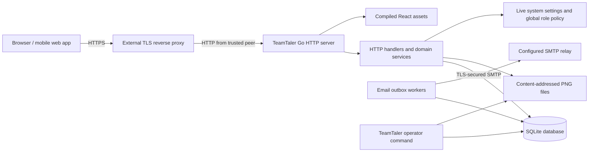

# TeamTaler Architecture

## System overview

TeamTaler is a self-hosted group expense and settlement application implemented as a modular monolith. One Go process serves the versioned JSON API and the compiled React single-page application. The same process owns authentication, global system administration, password recovery, verified email changes, group authorization, temporary-guest and regular-account lifecycle, group provisioning/archive/purge, versioned runtime settings, domain transactions, SQLite access, image delivery, dynamic SMTP delivery, health endpoints, and request logging.

Production uses one TeamTaler application replica, one SQLite database on a local filesystem, and content-addressed product images, group logos, and user profile images below the application data directory. An external reverse proxy terminates TLS. The `teamtaler` binary also provides operator commands that open the same local database or data directory directly.



This topology deliberately avoids a separate application server, database server, cache, queue, or object store. It is suitable for a small server but does not support horizontal application replicas.

## Repository and module structure

### Process entry point

- `cmd/teamtaler` selects the server, health, backup/restore, bootstrap, system-role, system-settings, SMTP, and global-group operator commands. The server applies host configuration and migrations, starts dynamic invitation-, public-registration-, account-action-, notification-email-, and media-garbage-collection workers, and shuts HTTP and worker activity down on `SIGINT` or `SIGTERM`.
- `cmd/teamtaler-testdata` is a development-only fixture builder. It composes the same authentication, system-role, group, catalog, booking, and finance services used by the HTTP server to populate an empty disposable database with two isolated groups, per-group catalog data, shared cross-group accounts, one group-local account, and one group-less system administrator; production builds and container images do not include this command.

### Backend packages

- `internal/auth` implements Argon2id password hashing, first-run bootstrap, login, validated fixed or most-recently-used group preferences, public authentication capabilities, profile and password changes, enumeration-resistant password reset, verified email changes, rate-limited secret-minimal invitation and public-link previews, public email-verified registration, ordinary invitation and temporary-guest claim acceptance, archived-membership reactivation with role replacement, profile-image lifecycle, opaque server-side sessions, logout, and expired-session cleanup. Credentialless guest identities are deliberately excluded from authentication and account-email queries.
- `internal/system` owns global `SYSTEM_ADMINISTRATOR` assignments, effective versioned instance settings, encrypted SMTP overrides and revision tests, account lookup, global group provisioning/archive/restore/purge, media deletion jobs, and the append-only global system audit. SMTP test delivery exercises either the immutable host configuration or a database override; only database-backed connection changes create and update revision-verification state. Permanent-deletion previews expose the member count and exact consolidated member-receivable balance while retaining the complete internal deletion counters for purge receipts. System-audit reads resolve stable actor user IDs to their current account display names while retaining the identifier as the durable reference and support full-history server-side search, typed filters, deterministic sorting, and keyset pagination. HTTP and CLI adapters call the same services.
- `internal/groups` implements group creation, tenant membership lookup, permission-gated identity and behavior settings including settlement availability, privacy-gated member listing, the shared member and temporary-guest archive/reactivate/permanent-removal lifecycle, temporary-guest rename and claim, group-owned role and grant management, optimistic role assignments, versioned public join-link lifecycle, individual invitation creation/editing/revocation/resending, shared invitation deduplication, and atomic idempotent CSV invitation imports.
- `internal/authorization` centralizes permission evaluation through `Policy.Can` and transaction-compatible `Require`, unions current role grants, expands implications, and evaluates tenant-bound resource context without cross-request caching.
- `internal/memberimport` parses bounded UTF-8 comma- or semicolon-delimited invitation documents and preserves row-level validation outcomes.
- `internal/email` implements the dynamic SMTP sender boundary, mandatory STARTTLS or implicit TLS transport, localized plain-text invitation, public-registration verification, password-reset, email-change, system-test, and notification rendering, and leased transactional-outbox dispatch with bounded retries. Workers read effective settings before every job and pause without consuming attempts while delivery or mutations are administratively disabled.
- `internal/catalog` implements category and product reads and writes, controlled category-icon validation, fixed or user-defined pricing modes, idempotent product creation, optimistic versions, and catalog authorization.
- `internal/media` validates JPEG/PNG/WebP input, strips metadata through PNG normalization, and owns content-addressed image paths shared by group logos, product images, and user profile images.
- `internal/bookings` resolves server-authoritative fixed prices or validates actor-supplied unit prices, then implements idempotent single, atomic multi-target, and atomic multi-product cart booking creation, transaction-bound temporary-guest creation, credential-class-specific target authorization, privacy-minimized booking context, immutable product/category/price snapshots, actor-based 30-second reason-free reversal, audited reversal, and tenant-safe full-history activity search, typed filters, deterministic sorting, and keyset pagination.
- `internal/finance` implements consolidated member accounts, lifecycle-aware active/archived/deleted balance summaries, personal and anonymous group category statistics with setting-dependent all-time or current-period scope, the `VIEW_GROUP_STATISTICS`-gated signed net group receivable, permission-gated group and own-account incoming payments, configured payment-method validation and label snapshots, payment reversal, recent ledger activity, full personal movement history, and finance-management read models. Payment and movement tables support server-side search, typed filters, deterministic sorting, and keyset pagination. Consolidated balances always use the complete ledger. Archived accounts remain settlement targets; deleted accounts are projected only while their current receivable is non-zero.
- `internal/ledger` rebuilds correction and payment allocations. Negative current-period corrections offset the oldest positive claims before non-reversed payments are allocated oldest first.
- `internal/periods` lists periods, rejects close commands while settlements are disabled, snapshots member statements, opens the successor period after an enabled close, and returns settlement status enriched with later allocations. The same technical open period remains active while settlements are disabled.
- `internal/notifications` atomically creates structured member notifications and optional email jobs only for identities with a real address, exposes exact unread summaries and cursor-backed member history, and applies tenant-scoped batch read acknowledgements.
- `internal/audit` writes group-scoped audit events and exposes tenant-bound full-history search, typed filters, deterministic sorting, and keyset pagination.
- `internal/tablequery` owns bounded global-search normalization, ISO 8601 date/RFC 3339 range normalization, escaped SQL contains patterns, normalized-query fingerprints, and opaque keyset cursor encoding shared by table-oriented backend queries.
- `internal/idempotency` validates keys and stores or replays mutation results.
- `internal/backup` creates consistent checksummed archives and validates/restores them.
- `internal/httpapi` registers routes and composes authentication, CSRF, origin, body-limit, security-header, request-log, recovery, and SPA middleware around the services.
- `internal/config` loads and validates immutable host configuration plus environment defaults for runtime-editable instance settings.
- `internal/storage` configures SQLite, applies embedded forward-only migrations, verifies their foreign-key integrity before commit, rejects unknown future migrations, and provides transaction helpers.
- `internal/domain` defines stable permission keys, scope-aware grants, role definitions and assignments, shared entities, permission implications, and transport-safe error classes.
- `internal/platform` provides random identifiers, random secrets, secret hashes, timestamps, the process clock, shared email normalization, and AES-256-GCM invitation-token envelopes.

The packages are internal implementation boundaries, not separately deployable services. Transaction-owning services call SQL directly through `database/sql`; there is no repository abstraction or runtime dependency-injection container.

### Development test runtime

`.codex/environments/environment.toml` exposes the **Start test server** action through `make test-server` and injects a fixed development-only email-token key for the disposable database, allowing SMTP settings entered through the system UI to be encrypted even when no relay is configured at startup. `scripts/test-server.sh` reads only an allowlisted SMTP variable set from the ignored `.env.test-server.local` file without evaluating it as shell code, builds the backend and fixture binaries, creates a permission-restricted temporary data directory below the ignored `tmp/test-server` path, seeds it through domain services, starts the backend on loopback port 8080, and starts Vite on loopback port 5173 with demo transport explicitly disabled. The fixture always retains the stable `admin@example.test` administrator login. When complete SMTP defaults are present, the script supplies their sender mailbox as the immutable SMTP test recipient so operator-triggered tests remain deliverable without changing fixture identity; SMTP-disabled runs omit that override. One shared process-aware HTTP readiness loop protects both services with a configurable positive-integer timeout and a 60-second default for cold Vite starts. The backend probe uses its application readiness route; the frontend probe reads the static `web/public/health/ready.txt` asset so it verifies Vite's HTTP listener without blocking on initial SPA dependency optimization. The fixture binary embeds local product and fictional profile images, normalizes them through `internal/media`, and attaches them through the same catalog and authentication services used by HTTP uploads; group settings receive deterministic booking and payment reason suggestions through `internal/groups`. Incomplete local SMTP credentials disable email delivery without blocking the server while preserving the action-provided encryption key. Vite proxies `/api` to the real backend. Signal handling terminates both child processes and deletes only the action-owned temporary database, so every run begins from the same logical fixture without touching operator data in `data/`.

### Schema and API

- `migrations` embeds forward-only SQL migrations into the Go binary.
- `api/openapi.yaml` documents the HTTP API contract. The Go handlers and service types remain the executable source of truth and must be kept synchronized with it.

### Frontend

- `web/src/app` owns the TanStack Router tree, query provider, global session context, strictly group-bound active-group provider, and top-level not-found handling. A nullable active group never makes group-domain components implicitly optional.
- `web/src/components` contains layout, navigation, brand, and reusable form/modal/state primitives. The shared `Modal` owns standardized desktop sizes, viewport-wide compact sheets, visual-viewport and safe-area handling, and a fixed header/body/footer structure in which only the body scrolls; feature styles do not override modal geometry. Callers provide persistent actions through the `footer` property or the nested `ModalFooter` portal when the workflow owns local state. Desktop and mobile navigation share one accessible custom group selector; it composes the generic listbox menu with a reusable protected-logo mark and first-letter fallback. The shared multi-select menu optionally searches both labels and stable values while retaining native checkbox semantics.
- Standard labelled actions use the shared `Button` primitive, whose typed contract requires a semantic Lucide icon and visible text. Item-scoped table, list, and card actions use `ItemAction`, which fixes their small borderless presentation and preserves visible labels across viewports; destructive consequences move to the shared `ConfirmationDialog`. Browser-native confirmation, alert, and prompt APIs are not used. `web/src/features/shared/DataTable` owns semantic tables, optional server- or client-side accessible single-column sorting, global search, typed filter sheets and chips, cursor loading, optional result feedback, and focusable horizontal mobile overflow with edge-state shadows; compact complete collections may omit query controls and redundant result feedback. `useDataTableUrlState` keeps each server-query table's namespaced search, filters, and ordering shareable without colliding with route or sibling-table parameters. Group and instance audit feeds normalize their different API records into `AuditEventTable`, which composes the same shared table contract and searchable multi-select filters. `GET /groups/{groupId}/audit/filter-options` and `GET /system/audit/filter-options` derive their complete distinct action, resource-type, and action-to-resource relationship catalogs from the authorized append-only event tables. The resource-type filter precedes the dependent action filter, so selected resource types expose only actions actually persisted for those types and synchronously remove impossible action selections. Audit list endpoints accept repeated exact values with OR semantics. Consequently, introducing a new recorded action or resource type requires no frontend registry change and automatically exposes it in the corresponding filter after the options query refreshes. Dense non-item action groups may opt into the button's accessible narrow icon-only presentation, while composite widgets and utility controls retain their specialized shared primitives. The normative visual and responsive rules live in `DESIGN.md`.
- `web/src/features` contains authentication, system administration, dashboard, booking, activity, account, notifications, permission-aware catalog, permission-aware finance, and group-administration slices. System administration renders general settings, tested email delivery, access/maintenance policy, global group lifecycle with protected group-logo previews and initial fallbacks, and global audit from session-reported system roles; unauthorized panels never mount system queries. Its responsive workspace uses shrinkable grid tracks throughout forms, lifecycle cards, and audit records, while the semantic administration tab list owns its narrow-viewport horizontal scrolling without creating page-level overflow. Group administration combines group identity, branding, notification delivery, default-role policy, transaction behavior, and settlement configuration; finance and booking configuration render when either group or finance management is effective. It separates membership, invitation, and guest lifecycle plus subject-centered role assignments from role definitions and grants. The booking slice consumes a dedicated minimal context, keeps one persistent recipient scope above the catalog, groups guests after regular targets, and owns a responsive multi-product cart whose lines share the same authorized targets and reason. New guest names leave the browser only as part of the atomic cart command. The notification slice owns the shell-level unread summary, shared badges, cursor-backed inbox, viewport acknowledgement, and retry state. The catalog slice owns the guarded `/catalog` workspace, contextual category/product creation, the accessible icon picker, and nested pointer/touch/keyboard catalog sorting. The finance slice owns the `/finance` overview, payment, and optional settlement/history tabs plus the reusable reviewed self-payment dialog shared by the dashboard and account page; the dashboard owns personal information, recent activity, and one permission-gated complete-ledger group balance without category statistics. Current-period presentation is omitted while settlements are disabled, whereas immutable history remains conditionally available when it exists. The shared category-icon renderer maps persisted semantic icon names to tree-shaken Lucide components.
- `web/src/api` contains the same-origin fetch client, wire-model adapters, money conversion, and frontend types.
- `web/src/demo` contains an explicit in-memory development transport and sample images. Vite includes them only when `VITE_DEMO_MODE=true` in a development build; production bundles exclude both fixtures and assets.
- `web/src/i18n.ts` initializes i18next, while `web/src/locales/de.ts` centralizes reusable German interface, error, and accessibility copy.
- `web/public` contains the source brand mark, generated browser/PWA icons, the web-app manifest, and bundled development-demo product images.

The authenticated route `/book` requires at least one of `CREATE_OWN_BOOKING`, `BOOK_FOR_OTHERS`, or `BOOK_FOR_GUESTS` and reads `/booking-context` rather than dashboard or member-directory queries. `/overview` contains personal member information, recent activity, a `VIEW_GROUP_STATISTICS`-gated signed net group receivable, and permission-specific actions such as the `RECORD_OWN_PAYMENT`-gated balance action. It intentionally renders no category or period statistics. The same payment action is available on `/account`. It opens a mobile bottom sheet or desktop dialog with entry, review, and success states; accounts with multiple active groups additionally choose a fixed login group or most-recently-used behavior there. `/activities` uses server-resolved booking actor/target names and lifecycle states, so it does not fetch the protected directory and can label retained tombstone history without exposing an old email or avatar. `/catalog` requires `CATALOG_MANAGEMENT`, while `/finance` requires `FINANCE_MANAGEMENT` and derives payment targets from finance-authorized account summaries. Those summaries group regular, temporary-guest, archived, and non-zero deleted accounts without querying the protected member directory. `/admin` places System first for a global system administrator, mounts General for `GROUP_ADMINISTRATION`, `ROLE_MANAGEMENT`, or `FINANCE_MANAGEMENT`, Audit for `GROUP_ADMINISTRATION`, Members for `MEMBER_MANAGEMENT`, and Roles & Rights for `ROLE_MANAGEMENT`; unauthorized controls and panels do not mount their queries. General exposes the membership default-role policy when either `GROUP_ADMINISTRATION` or `ROLE_MANAGEMENT` is effective. Identity, branding, and notification delivery require group administration; finance and booking configuration require either group administration or finance management. A system administrator with no active group receives a reduced shell with System, Account, and Logout, and group-only deep links resolve to System. The Members tab owns membership, invitation, guest, public-join, and ordinary-assignment lifecycle operations. Its active and archived member collections use compact client-sorted shared data tables: member and email columns sort in German locale order, active role assignments sort by their localized labels, action columns remain unsortable, and narrow viewports expose the same animated edge shadows and scroll hint as activity and audit tables without adding search or filters. Its input-heavy invitation, import, editing, guest-claim, and reactivation workflows use the shared compact bottom-sheet contract, while destructive decision-only confirmations remain centered dialogs. Protected administrator assignments additionally require group administration. Public routes `/join`, `/join/verify`, `/reset-password`, and `/email-change/confirm` consume secrets exclusively from URL fragments; `/join` offers authentication for existing accounts and verified registration for new accounts. `/forgot-password` starts the enumeration-resistant reset flow. Login and public surfaces also read instance capabilities so maintenance and globally disabled public joining are represented without exposing secrets. `/` and post-authentication transitions first handle a groupless system administrator, otherwise honor the server-selected active group and choose its first permitted destination in the order booking, finance, catalog, administration, overview. The retired `/reports` route redirects to `/overview`; other explicit deep links remain stable and are not replaced by launch routing.

Mobile navigation always contains overview, activities, and overflow; booking is included when at least one of `CREATE_OWN_BOOKING`, `BOOK_FOR_OTHERS`, or `BOOK_FOR_GUESTS` is effective. The overflow page always starts with notifications and then contains authorized management destinations in the deterministic order finance, catalog, administration, account, and logout; unavailable capabilities are omitted without reordering the remaining entries. A shared notification-summary query places the exact unread count on the desktop notification destination and mobile overflow button. A central typed `can(permission, scope?)` evaluator reads `effectiveGrants` from the active membership and gates navigation, booking targets, own-account payments, permission-specific overview content, and query-owning panels. The API independently repeats every authorization decision. The administration role editor presents explicit grants in four labelled topic regions for administration and members, bookings and activity, finance and reporting, and catalog. It preserves inherited implications, reserved-role protection, assignment counts, and role duplication without deriving capabilities from role names; its single Save action performs the versioned write directly. Empty topic regions are omitted when the server exposes only a subset of definitions. The members workspace presents multiple role chips in a compact trigger; its desktop popover and mobile sheet require a non-empty assignment, enforce protected-administrator rules, retain an isolated draft, and write only after the operator selects Apply. Optimistic assignment conflicts refresh member, invitation, role, aggregate-assignment, and session queries before asking the operator to review the draft again.

Financial color semantics are shared across member-facing surfaces. Positive incoming payments and credit balances use the existing `--color-green-600` token used by the finance summary. Open-balance values follow the ledger convention: a negative value is credit in the member's favor and therefore green, while a positive amount is still owed and remains orange.

The activity booking query and personal dashboard booking query intentionally use separate visibility policies. `VIEW_ALL_BOOKING_ACTIVITY`, whether explicit or implied by `VOID_ANY_BOOKING`, expands only the activity query to the complete historical group stream. Other active members receive their actor- and target-relevant activity. This permission never expands personal balances, overview statistics, dashboard recents, or mutation authorization. `VIEW_MEMBER_DIRECTORY` remains a hidden compatibility read for membership email, role, and grant data; `MEMBER_MANAGEMENT` and `BOOK_FOR_OTHERS` imply it, but only member management exposes archived lifecycle records or mutations. `BOOK_FOR_GUESTS` does not imply directory access. `VIEW_GROUP_STATISTICS` controls retained anonymous aggregate data and the complete-ledger group receivable without exposing member-level balances. Group settings expose settlement availability, notification-email behavior, the stable default-role reference used for invitations and claims, and transaction behavior. Default-role writes require role management or group administration. Notification delivery requires group administration; settlement and transaction configuration require either group or finance management. Settlement availability changes close policy and statistics presentation, but never replaces the technical open period or changes complete-ledger balances.

The frontend consumes response monetary fields as exact decimal strings and uses `BigInt` for adaptation and formatting. Currency-specific fraction digits come from `Intl.NumberFormat`, including zero- and three-decimal currencies; syntactically valid private currency codes fall back to two fraction digits. Command requests send bounded JSON integers. Booking responses provide `canVoid`, `voidReasonRequired`, and an optional `voidWithoutReasonUntil`, so the browser does not reconstruct security policy from roles or timestamps.

### Binding UI/UX architecture constraints

Regular-member experiences are mobile-first. Their information hierarchy, controls, loading states, error recovery, and complete workflows must be designed and validated at narrow phone widths before desktop enhancements are added. Wider layouts may increase density or show supplemental context without changing the mobile workflow's meaning or making mobile a reduced secondary experience. Administration, catalog, and finance workspaces may prioritize larger screens, but they must remain responsive and accessible.

User-facing copy is governed by a minimum-necessary language budget: as little text as possible and as much as required for a clear, safe action. The interface uses short, familiar German words, direct sentences, and user-visible outcomes. It does not expose implementation details, internal terminology, permission keys, API concepts, storage behavior, or authentication mechanics. A technical failure is translated into its practical effect and the simplest available recovery action. Explanatory copy is added only when the user could otherwise make an incorrect decision, become blocked, or miss a material consequence.

Product booking is the primary member workflow and is governed by an interaction budget. For the common case of a visible fixed-price product booked by the current member with quantity one, the user must be able to complete the booking in at most two deliberate interactions: product selection and booking confirmation. The UI must derive the current membership, default quantity, current period, catalog price, and currency from existing state. It must request additional input only when the chosen command requires it, including a user-defined price, changed quantity, third-party target, or mandatory reason.

Product selection adds a line to the current cart and a repeated selection increments that line's quantity. Selected catalog cards expose a separate decrement control; at quantity one the same location becomes a remove control and deletes the line. The desktop inspector and mobile viewport-attached summary expose the same cart state and one confirmation action. The compact cart has explicit `peek`, `summary`, and `details` presentation states and reuses the shared production sheet radius, handle, elevation, spacing, and motion while leaving the catalog interactive. The first fixed-price product opens `summary`; each subsequent fixed-price product tap moves the cart to `peek`, which preserves only product count and total in a 77 px strip above mobile navigation. A user-defined-price product always opens `details` on compact screens and remains directly editable in the desktop inspector; on every viewport the product-selection event carries a monotonically increasing request identifier so repeated selections can focus the exact required price input and align its line to the top of the cart's internal overflow region without scrolling the page or moving the persistent checkout. A downward drag of at least 64 px, or a sufficiently fast 28 px swipe, moves an open cart to `peek`; the same handle provides a keyboard and single-pointer fallback without displaying another icon. Authorized third-party bookers change the cart-level target scope once through a square recipient icon button beside the open-balance card. The separate button and balance card share the same responsive height. Its badge shows the target count. The target editor remains an anchored popover from 768 CSS pixels upward and uses the shared modal bottom sheet only on phones. That sheet follows the browser visual viewport above software keyboards and isolates overflow in a safe-area-aware content region below its fixed header. The shared `Modal` sheet variant owns downward pointer and mouse-fallback tracking on its handle, a 64 px distance or fast 28 px velocity threshold, snap-back for incomplete gestures, a 220 ms close transition, reduced-motion handling, and a keyboard/tap fallback; content scrolling never initiates dismissal. Self remains the safe default and therefore adds no interaction to the common own-booking path. All lines apply to all selected targets. The open cart omits recipient names from its header. With one target the checkout renders only the resulting booking count and total; with multiple targets it renders the total first and a smaller Lucide product-times-people-equals-bookings equation on the following line while a visually hidden localized sentence preserves the complete relationship for assistive technology. Within the open viewport-bound cart, line items and price or quantity details own the overflow region; a mandatory shared reason, the result, total, validation state, and primary action share a non-scrolling checkout footer. Between 768 and 1023 CSS pixels, the fixed checkout starts after the persistent sidebar instead of occupying the obscured full viewport. The UI displays the Cartesian line-target count before submission, rejects more than 25 distinct lines or 500 expanded bookings, and resets the complete draft on active-group changes. A successful write empties the cart and restores self as the safe default target when available.

The following constraints are architectural acceptance criteria for member-facing UI changes:

- Primary booking controls must be visible, thumb-reachable, and usable without horizontal scrolling at supported phone widths.
- Navigation, secondary statistics, and role-specific controls must not interrupt the standard self-booking path.
- Modal dialogs and confirmation steps must not be added to that path without a documented accounting, security, safety, or irreversible-action requirement.
- Categories may be selected for orientation, but products must remain unselected and confirmation controls closed until the member explicitly chooses a product.
- A successful booking acknowledgment must automatically return the booking surface to its neutral product-selection state after a short delay; repeated bookings must require no navigation and retain the two-interaction selection-and-confirmation budget.
- Loading and mutation handling must prevent duplicate writes without adding avoidable user actions; idempotency remains a server and client responsibility rather than a confirmation burden.
- Labels and action text must use the shortest familiar wording that remains unambiguous in context.
- Hints must not repeat visible labels, explain standard controls, or describe implementation mechanics.
- Empty states and errors must state the user-visible situation and, when needed, one clear next action in plain language.
- Long paragraphs, technical explanations, internal identifiers, and developer terminology are prohibited in application copy.
- Browser acceptance for booking changes must measure the interaction count and verify the narrow mobile viewport before desktop approval.

## Data model

The initial schema consists of strict SQLite tables plus the migration ledger:

| Table | Responsibility |
| --- | --- |
| `schema_migrations` | Applied embedded migration filenames. |
| `users` | Global local identities, nullable email/password credentials constrained to be both present or both absent, optional profile-image keys, and nullable fixed-default plus most-recently-used group references. Credentialless rows back temporary guests but still have stable IDs. |
| `sessions` | Hashed session and CSRF secrets, expiry, and throttled last-seen time. |
| `system_role_assignments` | CLI-managed global role assignments keyed by stable user ID. V1 permits only `SYSTEM_ADMINISTRATOR`. |
| `system_settings_state` | Singleton aggregate settings revision plus the persisted/tested SMTP revision and secret-free change metadata. |
| `system_setting_overrides` | Typed per-key instance overrides, including the encrypted SMTP password envelope; absence means the environment or code default is effective. Secret material is write-only at every external interface. |
| `system_audit_events` | Append-only global system mutations and minimal completed group-purge receipts. |
| `system_media_delete_jobs` | Repeatable content-hash garbage-collection work created only after database references are gone. |
| `system_group_purge_context` | A transaction-local guard row that opens immutable group-delete triggers for exactly one purged tenant and is removed with that group. |
| `groups` | Tenant name, three-letter accounting currency, optional custom-logo image key, lifecycle status (`PROVISIONING`, `ACTIVE`, `ARCHIVED`, or internal `PURGING`), optimistic version, and archive metadata. |
| `group_settings` | One typed group-administration behavior record per group, including four `OFF`/`OPTIONAL`/`REQUIRED` transaction-reason modes, required `settlements_enabled` defaulting to false, optional notification email delivery, a nullable tenant-bound default-role reference, deprecated reason-required compatibility booleans, and the inert activity-visibility compatibility field. |
| `memberships` | User participation, active/archive status, optional permanent-removal timestamp, role-assignment collection version, and an optional normalized temporary-guest name key that is case-insensitively unique among active credentialless guests in a group. Permanently removed memberships remain as historical tombstones. |
| `permission_definitions` | Stable permission-key registry with descriptions and implication metadata; the API adds allowed-scope metadata from policy. |
| `roles` | Group-owned named roles, optional preset identity, protection state, optimistic version, and audit timestamps. |
| `role_permission_grants` | Many-to-many role grants with tenant-bound `GROUP`, `CATEGORY`, or `PRODUCT` scope columns; v1 writes accept only `GROUP`. |
| `membership_role_assignments` | Many-to-many role assignments for active memberships. |
| `invitation_role_assignments` | Role defaults attached to pending invitations and consumed during acceptance or reactivation. |
| `membership_roles`, `membership_permissions`, `category_permissions` | Deprecated v1 compatibility storage; no authorization decision reads these legacy tables after `0017`, and category rows are cleared during the upgrade. The matching legacy invitation JSON columns follow the same adapter-only rule. |
| `categories` | User-defined product category, controlled visual icon, active state, sort order, and version. |
| `products` | Category, current name, `FIXED` or `USER_DEFINED` pricing mode, optional fixed price, optional image key, active state, sort order, and version. |
| `periods` | Exactly one open period per group plus closed interval metadata and due date. |
| `bookings` | Actor, target, quantity, immutable catalog/price snapshots, reason, and void metadata. |
| `payments` | Received money, member, method, references, and reversal metadata. |
| `payment_allocations` | Parts of non-reversed payments allocated to period claims. |
| `period_adjustment_allocations` | Negative correction value applied from one period to an older positive claim. |
| `ledger_entries` | Immutable member receivable, category revenue, and group cash movements. |
| `period_statements` | Immutable close-time member snapshots, including a nullable email snapshot plus payment and correction fields at close. |
| `invitations` | Hashed single-use tokens, invited email, optional display name, optional stable target user, optional temporary-guest target membership, role-assignment collection version, expiry, and acceptance/revocation state. |
| `invitation_email_outbox` | Encrypted temporary token envelopes, delivery state, retry schedule, worker leases, safe failure codes, and SMTP acceptance time. |
| `public_join_links` | One group-scoped hashed and encrypted reusable token, enabled state, optional expiry, audit actors, and optimistic version. |
| `public_join_registrations` | Pending email-verified account material bound to a group and join-link version, with hashed one-time proof, expiry, consumption, and invalidation state. |
| `public_join_email_outbox` | Encrypted temporary verification-token envelopes, bounded retry state, worker leases, safe failure codes, and SMTP acceptance time. |
| `account_security_actions` | One-hour password-reset or email-change proofs with source and optional target address, unique token hash, consumption, invalidation, and supersession state. |
| `account_security_email_outbox` | AES-GCM-encrypted account-action token envelopes, bounded retry state, worker leases, safe failure codes, and SMTP acceptance time. |
| `notifications` | Structured member-visible events, resource context, read state, and stable newest-first ordering. |
| `notification_email_outbox` | Optional notification delivery state, bounded retry schedule, worker leases, safe failure codes, and SMTP acceptance time. |
| `audit_events` | Immutable administrative and domain action history. |
| `idempotency_results` | Request hash and serialized response for protected mutation retries. |

Tenant-bearing queries are scoped by `group_id`. Composite foreign keys protect important group-owned relationships such as default roles, grants, assignments, claim targets, products, bookings, allocations, and ledger references. Scope shape constraints require a group grant to carry no resource identifier, a category grant to reference a category in the same group, and a product grant to reference a product in the same group. Category and product shapes are stored for forward compatibility but are rejected by v1 service and HTTP validation.

System settings resolve with the fixed precedence persisted override, environment default, then code default. An otherwise unconfigured SMTP block remains disabled but exposes port `587` and `starttls` as safe form and CLI defaults. The effective read model reports value, source, version, and change metadata; resetting deletes only the override. Request middleware resolves one consistent settings snapshot per API request, while workers resolve a new snapshot before each job. Host-only public URL, listener, proxy, path, cryptographic-key, container, and maximum-request settings never enter this table.

Every newly created group has five seeded roles. `GROUP_ADMINISTRATOR` is the only preset-backed reserved group role: it is protected, retains the fixed persisted name `Group administrator`, starts with `GROUP_ADMINISTRATION`, `MEMBER_MANAGEMENT`, `ROLE_MANAGEMENT`, and `VIEW_MEMBER_DIRECTORY`, and cannot lose the three direct management grants. Every role-facing web surface resolves that stable preset key to the localized German display name `Gruppenadministrator`; custom role names remain verbatim and authorization never depends on display text. The preset is unrelated to the global `SYSTEM_ADMINISTRATOR` assignment. The four remaining seeds are ordinary roles with no preset key or authorization semantics beyond their grants. `Mitglied` starts with `CREATE_OWN_BOOKING` plus `VIEW_MEMBER_DIRECTORY`. `Finanzverwaltung` starts with `FINANCE_MANAGEMENT`, `RECORD_OWN_PAYMENT`, `VIEW_ALL_BOOKING_ACTIVITY`, `VIEW_GROUP_STATISTICS`, and `VIEW_MEMBER_DIRECTORY`. `Katalogverwaltung` starts with `CATALOG_MANAGEMENT` plus `VIEW_MEMBER_DIRECTORY`. `Gast` grants only `CREATE_OWN_BOOKING` and is selected as the initial default role. All ordinary roles may be renamed, modified, or deleted when they have no active-member or pending-invitation assignments and are not the current default. Starter/default roles cannot contain `GROUP_ADMINISTRATION` or `MEMBER_MANAGEMENT`. Expired invitation assignments do not block deletion and are removed by the role foreign-key cascade. Role names are trimmed, reject control characters, and are case-insensitively unique within a group.

The group-insert trigger seeds the protected administrator and four ordinary template roles. The first active membership receives only the reserved administrator role, so finance, catalog, statistics, and booking capabilities remain opt-in through additional assignments. Archiving switches the row to `ARCHIVED`, clears role assignments, and retains the stable membership ID and all dependent history. Explicit reactivation assigns the selected role set to a credentialed member or restores a credentialless guest without roles. Permanent removal retains the archived row as an immutable tombstone after an exact zero-balance check. Ordinary invitation acceptance may reactivate only an archived non-deleted membership and applies exactly the invitation's explicit non-empty role set. Temporary-guest claim acceptance preserves its target membership and installs exactly the claim invitation's roles. Every login-enabled active membership and pending invitation must retain at least one assignment; an active membership backed by a credentialless temporary identity is the deliberate roleless exception. A temporary identity may receive roles only while the same assignments are prepared by an open claim invitation. The reserved administrator role must additionally remain assigned to at least one active membership. An ordinary role containing `GROUP_ADMINISTRATION` does not satisfy this invariant. Database constraints and serialized service transactions jointly protect the reserved role, the default-role reference, credential coupling, claim-role preparation, conditional minimum assignment cardinality, deleted-state immutability, and the last active administrator assignment.

Temporary-guest status is not a second membership kind. `Membership.isTemporaryGuest` is derived only from a user row whose email and password hash are both null. Temporary guests keep a required `user_id` but cannot satisfy login or session queries. Claiming with an existing account may rebind `user_id`, while the membership ID and all accounting references remain stable. Once credentials exist, `isTemporaryGuest` becomes false and normal role management applies. No synthetic address, placeholder password, role assignment, preset label, or role-name comparison participates in classification.

Prices and ledger amounts are persisted and calculated as signed 64-bit integer minor units. A fixed-price product stores a positive `price_minor`; a user-defined-price product stores no catalog price and requires a new positive unit price, bounded to 100,000,000,000 minor units, on every booking. The schema enforces valid mode/price combinations. API responses serialize monetary fields as exact base-10 strings so browsers cannot lose precision above JavaScript's safe-integer limit; command inputs remain bounded JSON integers. Currency input is restricted to three uppercase ASCII letters but is not checked against an external ISO 4217 registry. A group has no time-zone or payment-instructions column in the current schema. Product images, group logos, and user profile images are files referenced by `products.image_key`, `groups.logo_key`, and `users.avatar_key`; there is no separate image-asset table.

`settlements_enabled` is a feature-policy flag rather than a period-state field. Every group retains exactly one open technical period regardless of this setting. Booking, payment, reversal, and correction entries continue to reference that period while settlements are disabled. Re-enabling does not create a boundary: the next close includes every applicable entry since the last actual close. Complete-ledger member and group balances are invariant across toggles. Anonymous category statistics select the open period when enabled and all periods when disabled.

SQLite triggers prevent update/delete of `ledger_entries`, `period_statements`, and `audit_events`, and prevent further updates to already closed `periods`. The service layer writes paired accounting entries in one transaction and integration tests verify balance for booking flows. The database schema does not implement a separate transaction/posting journal or a trigger that independently proves every set of ledger entries balances.

## Authorization model

Global system authorization is independent of the group role and grant model. `SYSTEM_ADMINISTRATOR` is assigned to a stable credentialed user only by bootstrap or the local CLI, never through HTTP, invitations, memberships, group roles, or role templates. Every protected system request reloads the assignment from SQLite; `Session.systemRoles` exists only to render navigation and is not trusted by the server. A system administrator receives no implicit group membership or group-domain access. Grant/revoke transactions preserve at least one active system administrator.

An authenticated user first resolves an active membership for the group in the request path. A central policy loads that membership's current role assignments and grants, unions duplicate grants, and expands implications. Grants are additive: there are no deny rules or direct membership exceptions. Authorization decisions use stable permission keys and resource context, never role names or preset labels.

| Permission key | Group-wide v1 capability |
| --- | --- |
| `GROUP_ADMINISTRATION` | Manage group identity, notification behavior, audit access, protected administrator assignments, and finance and booking settings. |
| `MEMBER_MANAGEMENT` | Manage memberships, invitations, guests, public join access, and ordinary role assignments; implies `VIEW_MEMBER_DIRECTORY`. |
| `ROLE_MANAGEMENT` | Create, update, and delete role definitions and grants; it independently permits changing the group default. |
| `FINANCE_MANAGEMENT` | Read group accounts and manage payments, payment reversal, settlement history, and period close when settlements are enabled. |
| `CATALOG_MANAGEMENT` | Create, update, order, archive, delete, and image-manage categories and products. |
| `VIEW_MEMBER_DIRECTORY` | Read membership email addresses, role assignments, and effective grants in the group directory. |
| `VIEW_GROUP_STATISTICS` | Read the signed consolidated group receivable shown as “Group balance”; does not expose another member's balance. |
| `VIEW_ALL_BOOKING_ACTIVITY` | Read all actor-identified booking activity in the group activity feed only. |
| `RECORD_OWN_PAYMENT` | Use the isolated self-service payment endpoint for the authenticated membership. |
| `CREATE_OWN_BOOKING` | Open the booking workspace and create bookings against the authenticated membership. |
| `VOID_OWN_BOOKING` | Reverse a booking when the current membership is its actor or charged target. |
| `VOID_ANY_BOOKING` | Reverse any group booking and implicitly receive `VOID_OWN_BOOKING` and `VIEW_ALL_BOOKING_ACTIVITY`. |
| `BOOK_FOR_OTHERS` | Create a reasoned booking for another credentialed active membership; implies `VIEW_MEMBER_DIRECTORY`. |
| `BOOK_FOR_GUESTS` | Create bookings for existing or newly created credentialless temporary guests without directory access. |

Implications are computed by policy and are not stored as duplicate grants. The current implication graph is `VOID_ANY_BOOKING -> {VOID_OWN_BOOKING, VIEW_ALL_BOOKING_ACTIVITY}`, `MEMBER_MANAGEMENT -> VIEW_MEMBER_DIRECTORY`, and `BOOK_FOR_OTHERS -> VIEW_MEMBER_DIRECTORY`. `PermissionGrant` includes a generic resource scope so future policy can decide category or product access through the same interface. v1 rejects every scope except `{type: "GROUP"}` to avoid advertising unenforced restrictions.

An active login-enabled membership retains limited non-administrative base behavior independently of grants: it may read its own account and notifications plus actor/target activity visible to it. Anonymous group aggregates and the signed group outstanding total require `VIEW_GROUP_STATISTICS`; member email, role, and grant data requires `VIEW_MEMBER_DIRECTORY`. Self-booking requires `CREATE_OWN_BOOKING`; credentialed foreign booking requires `BOOK_FOR_OTHERS`; temporary-guest booking requires `BOOK_FOR_GUESTS`. These permissions are independent. `VIEW_ALL_BOOKING_ACTIVITY` does not expose another member's ledger or personal dashboard. `RECORD_OWN_PAYMENT` derives its target from the authenticated membership and does not imply finance reads or payment reversal.

Role definition changes require `ROLE_MANAGEMENT`. A change to `GROUP_ADMINISTRATION` or to the reserved administrator role additionally requires `GROUP_ADMINISTRATION`. Every role assignment requires `MEMBER_MANAGEMENT`; assigning or removing the reserved administrator role or another role containing administrator access additionally requires `GROUP_ADMINISTRATION`. The reserved role's name, deletion state, and three management grants are immutable. Its last active assignment cannot be removed or archived, even if another custom role carries administrator access.

`CREATE_OWN_BOOKING` authorizes only a booking charged to the current membership. `BOOK_FOR_OTHERS` authorizes only bookings charged to another credentialed active membership and always requires a reason. `BOOK_FOR_GUESTS` authorizes only credentialless targets and never creates a reason requirement. `VOID_OWN_BOOKING` covers a booking when the current membership is either its actor or its charged target. Only the actor receives a reason-free reversal window for 30 seconds after creation. Later actor reversal and target reversal of a booking created by somebody else remain available with a mandatory reason. A membership that is neither actor nor target requires `VOID_ANY_BOOKING` and a reason. Booking responses expose the already-evaluated reversal capability and reason requirement to prevent clients from duplicating policy.

## Data flow

### Session-authenticated request

1. The HTTP layer limits the request body and attaches a request identifier.
2. A hashed session-cookie lookup resolves the global user.
3. Non-safe methods validate the exact configured browser origin and compare the `X-CSRF-Token` header with the session-bound CSRF token.
4. A group handler resolves the active membership for the path's `groupID` and loads its current effective grants.
5. The domain service applies stable permission-key, resource-scope, tenant, state, and version checks. It never authorizes through a role name.
6. A transaction persists the command, accounting effects, notifications, audit event, and idempotency result where applicable.
7. The HTTP layer returns JSON or RFC 9457-shaped Problem Details.

The request middleware also resolves one immutable effective system-settings snapshot. Maintenance mode permits login, logout, safe reads, health probes, and system administration; it rejects other mutations with `503` before domain work begins. System handlers skip group membership resolution but reload the global role and, for a mutation, revalidate it inside the serialized write transaction.

### System setting and SMTP revision

1. A system administrator reads effective values together with their environment/code/override source, version, and hard host limit.
2. A mutation supplies the current strong ETag, passes CSRF and exact-origin checks, and revalidates the global role in the write transaction.
3. A normal setting write stores a typed override and appends a secret-free system audit event; reset deletes the selected override.
4. An SMTP write validates the complete TLS-only configuration, derives an encryption key from `TEAMTALER_EMAIL_TOKEN_KEY`, encrypts the password, increments the configuration revision, and leaves the persisted sender disabled.
5. The rate-limited test command sends to the current system administrator account or the immutable host-configured SMTP test recipient and records `VERIFIED` or `FAILED` for only the unchanged revision. The recipient override is validated at startup, never returned by the API, and does not affect other application mail. Enablement rejects an untested, failed, or subsequently changed revision. Before dialing, the sender resolves and pins the checked address; the immutable host network policy rejects restricted targets unless it explicitly permits private runtime relays or the target exactly matches the environment relay host and port.
6. Later requests and workers observe the new effective snapshot without restarting the process. Passwords and encryption envelopes never appear in responses, logs, or audit metadata.

### Global group lifecycle

1. Creation with an existing account inserts an `ACTIVE` group, its standard templates, protected administrator membership, and open technical period atomically. The acting system administrator is not joined unless it is the selected initial account.
2. Creation with a new address inserts a `PROVISIONING` group and protected first-administrator invitation and returns the one-time fragment URL for manual sharing. When effective SMTP and token encryption are active, the same transaction additionally queues an encrypted delivery job. Acceptance creates or attaches the account and membership and activates the group in one transaction. A system administrator may replace an expired or compromised first-administrator invitation only with the current group ETag; one transaction revalidates the global role and `PROVISIONING` state, revokes open invitations, cancels non-terminal invitation mail jobs, inserts a fresh seven-day token and protected assignment, optionally queues encrypted delivery, returns the new link once, records both audit events, and increments the group version.
3. Archive changes the current versioned group to `ARCHIVED`, records whether it came from `ACTIVE` or `PROVISIONING`, clears session preferences, disables its public link, invalidates pending invitations and registrations, and cancels queued group email work. Regular group routes resolve only `ACTIVE` groups. Restore returns the retained data to its pre-archive lifecycle state but does not reactivate old external links or invitations.
4. Deletion impact calculates member, invitation, booking, finance, audit, and media counts for an archived group without changing it.
5. Web purge requires the current ETag and exact current group name. CLI purge requires the exact name interactively or through `--confirm-name`.
6. The transaction marks the group `PURGING`, deletes every group-owned row under the narrowly scoped purge guard, verifies foreign keys, appends one minimal global receipt, enqueues candidate image hashes, and records that a WAL checkpoint is required. SQLite secure deletion and a verified truncated WAL checkpoint sanitize the active database files; a busy checkpoint remains durable maintenance work rather than reversing the committed purge response. Asynchronous idempotent garbage collection holds the same per-hash lease used by upload publication and database attachment, remains pending while a reference exists, and removes a managed file after a later reference-free check.

### Cross-group invitation identity

1. Every invitation is tenant-scoped and retains its own explicit role assignments. Invitations to the same normalized email address never union or copy authorization between groups.
2. Creation binds an invitation immediately when the mailbox already belongs to a credentialed account. Otherwise the target remains unbound and the token-specific preview reports `NEW`.
3. Acceptance echoes the previewed account state. The serialized transaction resolves the stable target or canonical mailbox and rejects a changed state before treating the password as either a new or current credential.
4. The first successful acceptance creates one globally unique account and binds every other open, unbound invitation for that mailbox to its stable user ID in the same transaction. A simultaneous acceptance therefore receives a typed conflict, keeps its token unused, reloads as `EXISTING`, clears credential fields, and can continue with the new account's current password.
5. Later acceptances create or reactivate only their invitation's group membership and apply exactly that invitation's roles. A provisioning invitation activates only its own group. A later account-email change does not retarget already bound invitations.

### Account profile, password recovery, and verified email change

1. The public capabilities endpoint derives `passwordResetAvailable` and `emailChangeAvailable` from complete SMTP and authenticated token-encryption configuration. Missing configuration hides only the matching browser entry points; both email-start commands also reject direct calls with `503`. Display-name and authenticated password changes remain local operations.
2. A valid password-reset request always returns the same empty `202` response. If its normalized address identifies an eligible credentialed account, one serialized transaction supersedes the older open reset, stores a hash of a new 256-bit one-hour token, encrypts the plaintext token into a `PENDING` account-security outbox job, and commits. An unknown address queues nothing and is otherwise indistinguishable to the caller.
3. An authenticated email-change request verifies the current password before the serialized transaction. The transaction keeps the current address unchanged, records an available normalized target in an open one-hour action, hashes its token, and stores only an authenticated ciphertext envelope for delivery. The request always returns `{verificationRequired: true}` after successful password verification, so a target already owned or reserved by another account creates neither an action nor an address-existence oracle.
4. The account-security worker leases due jobs, reloads and validates the action, decrypts its token only in memory, constructs `/reset-password#token=...` or `/email-change/confirm#token=...`, and submits the message through TLS-secured SMTP outside the database transaction. Relay acceptance changes the job to `SENT` and removes its ciphertext. Safe transient failures use bounded backoff for at most five attempts; invalidated or expired actions are cancelled without network access.
5. A confirmation endpoint receives the fragment token in a JSON body and hashes it for lookup. One serialized transaction checks action kind, expiry, consumption, invalidation, and target-email uniqueness, then either replaces the password hash or updates the existing user's normalized email. It consumes the action, invalidates the user's remaining open account-security actions, clears their outbox secrets, and revokes every user session. Email confirmation changes no user, membership, ledger, statement, or audit identifier.
6. An authenticated password change verifies the current password, computes the replacement Argon2id hash outside the write transaction, then replaces the hash and revokes every session, including the current one. A profile update changes only the global display name and leaves credentials, sessions, memberships, and accounting identity intact.

Like the other SMTP-backed queues, account-security email delivery is at least once: loss of the local success update after remote acceptance may send the same single-use link again, but consuming either copy invalidates replay.

### Account group selection

1. A multi-group account selects either one available group identifier or most-recently-used behavior in `/account` through the shared custom listbox; concrete group options reuse the navigation's protected logo-or-initial identity.
2. `PUT /api/v1/me/group-preference` persists the fixed identifier or null only after validating an active membership owned by the authenticated user.
3. Every explicit group switch updates local navigation immediately and queues `PUT /api/v1/me/group-preference/last-used`; write failures never block navigation, and later switches remain ordered.
4. Login and session reads resolve the active group from a still-available fixed default, then a still-available last-used group, then the first available group. Archived, deleted, foreign, or otherwise unavailable references are ignored.

### Role definition and assignment mutation

1. The client reads permission definitions, group roles, and assignments. Role and assignment resources return strong version ETags.
2. The client sends a complete replacement command with `If-Match`. Role grants use the generic scope wire shape, but v1 accepts only `GROUP`.
3. A serialized SQLite write transaction reloads the actor's active membership, current role assignments, and current role or subject version. A stale version returns `412` before any write.
4. The central policy rechecks `ROLE_MANAGEMENT` for role-definition changes and `MEMBER_MANAGEMENT` for every assignment change. Reserved or custom administrator-capable assignments additionally require `GROUP_ADMINISTRATION`.
5. The service validates tenant ownership, stable permission keys, role-name uniqueness, reserved-role protection, a non-empty assignment, and the exact reserved-administrator invariant.
6. The transaction replaces grants or assignments, increments the owning version, records an audit event, and commits. Revoked access is effective on the next authorization check because permission results are not cached across requests.
7. Role deletion first counts active membership and pending unexpired invitation assignments. A used or protected role returns `409`; an otherwise unused editable role is deleted transactionally, with stale expired-invitation rows removed by cascade.

### Invitation creation and email delivery

1. A member with `MEMBER_MANAGEMENT` creates one invitation manually with one or more selected role identifiers, or uploads at most 256 KiB and 100 CSV rows with an idempotency key. The manual UI preselects the configured default without making it mandatory. CSV rows may provide case-insensitive role names separated by `|`; otherwise a deprecated shared role-ID set or the group default is used. Administrator-capable selections additionally require `GROUP_ADMINISTRATION`.
2. The HTTP layer validates the manual JSON command or CSV structure. Inside the serialized import transaction, the shared group service resolves row role names and the current default, normalizes addresses, and rejects an active membership or current invitation across both paths; an archived membership may be invited for reactivation. Unknown roles or a missing fallback invalidate only their row. Database triggers prevent concurrent creation or token rotation from producing duplicate current invitations.
3. When SMTP is configured, one SQLite transaction creates each valid seven-day invitation, encrypts its plaintext token with AES-256-GCM, inserts its `PENDING` outbox job, and writes audit events. CSV imports also store their secret-free idempotency response. Manual creation returns the plaintext fragment URL once so the administrator retains a fallback link; without SMTP it creates only this manually shareable invitation.
4. Outbox workers claim due jobs with short database leases. Revoked, accepted, or expired invitations are cancelled before network access.
5. The worker decrypts a token only in memory, constructs the public fragment URL, and submits the message through the configured TLS-secured SMTP relay outside the database transaction.
6. SMTP acceptance moves the job to `SENT` and deletes the ciphertext. A safe failure code schedules bounded backoff; the raw SMTP error and token never enter API responses or audit metadata.
7. The administration UI polls invitation metadata while jobs are `PENDING` or `SENDING`, groups open invitations separately from active and former members, and supports role assignment, edit, revoke, and token-rotating renewal operations. Renewal is idempotent, is blocked during active delivery, invalidates older links, and returns its new fallback URL once. The request uses the current runtime SMTP state: without SMTP the link is manual-only, while enabling SMTP after the original invitation causes the renewed link to be both returned and queued for email delivery.
8. The public preview endpoint returns only a suggested display name and an existing-account flag. Acceptance atomically consumes the invitation's base and selected role assignments; a matching archived membership is reactivated under the same ID with its assignments fully replaced. Existing accounts retain their global display name.

The database-to-SMTP boundary provides at-least-once delivery. A connection failure after remote acceptance but before the local success update can produce a duplicate message with the same single-use link; consuming either copy invalidates replay.

### Temporary guest booking and claim

1. `/booking-context` opens for any of the three booking permissions and returns the open period, authenticated membership's exact balance, current membership, filtered minimal targets, and `canBookForGuests`. `CREATE_OWN_BOOKING` contributes only self, `BOOK_FOR_OTHERS` contributes only credentialed foreign members, and `BOOK_FOR_GUESTS` contributes only credentialless guests plus inline creation. It never returns target emails, roles, grants, balances, or group statistics.
2. An idempotent batch or bulk booking may contain existing target IDs, temporary guest display names, or both, with a combined maximum of 100. A bulk command additionally contains 1 to 25 distinct product lines and may expand to at most 500 product-target bookings. The transaction classifies every target from current credentials and requires every represented permission independently. A reason is required only when group policy requires one and a credentialed foreign member is present. Each new name receives one credentialless user row and roleless active membership reused by every cart line. Product versions, prices, quantities, targets, and the open period are validated before any cart rows are written. The one stored idempotency result covers the complete ordered response. Any failure rolls every guest, booking, ledger pair, allocation, notification, and audit row back. Active temporary-guest names are case-insensitively unique; a conflict returns `existingMembershipId` but never selects or merges it implicitly.
3. `MEMBER_MANAGEMENT` may rename an active credentialless guest, archive any guest membership, or create one conflict-protected claim invitation. Claim creation requires at least one regular role and allows only one open claim per guest. Ordinary roles need no role-definition permission; administrator-capable roles additionally require `GROUP_ADMINISTRATION`.
4. Claim acceptance consumes the invitation once, preserves its target membership ID and all accounting references, attaches credentials or an authenticated existing global user, clears the temporary name key, and installs exactly the invitation's roles. A conflicting group membership is rejected rather than merging financial histories. The membership then becomes a regular account with `isTemporaryGuest=false`.
5. Credentialless guests can receive durable in-app events bound to their membership, but notification email outbox creation is skipped while their email is null. After claim, future eligible notifications use the real address; no synthetic address is ever persisted or delivered.

### Public join-link and verified registration

1. A member with `MEMBER_MANAGEMENT` creates or updates the group's single public link with a finite one-hour-to-365-day expiry or unlimited availability. The groups service checks complete SMTP/token-box configuration, the safe current default role, and the expected version inside the same serialized write transaction.
2. The reusable random token is stored as a SHA-256 hash for public lookup and as AES-256-GCM ciphertext so authorized administrators can reopen the management dialog. The API constructs a fragment URL only for an enabled, unexpired link. QR encoding happens locally in the browser and never calls a third-party service.
3. Existing accounts authenticate normally and submit the fragment token in a CSRF-protected request. A new account submits its profile and password through a rate-limited endpoint; the password is Argon2id-hashed before the write transaction, and a one-time verification proof is encrypted into the public-registration outbox.
4. The worker leases the outbox job, revalidates registration, link version, link state, and both expiries, decrypts the proof only in memory, and sends a one-hour fragment URL through TLS-secured SMTP. Generic start and resend responses do not reveal whether an account or pending registration exists.
5. Verification atomically consumes the proof, creates the account, creates the membership, assigns the group's current non-administrative default role, creates a session, cancels the outbox secret, and records an audit event. An authenticated archived membership is reactivated under its stable identity after its old roles are replaced by that same current default.
6. Lifetime edits preserve the token. Rotation replaces it and increments the link version. Rotation and deactivation invalidate pending registrations and cancel their outbox secrets in the same transaction, so an older URL, QR code, or mailbox proof cannot complete afterward.

### Notification creation, acknowledgement, and email delivery

1. Booking, payment, reversal, and period-close services call the shared notification writer inside their existing SQLite transaction. Only events external to the target are emitted, except system-generated period settlements, which are always delivered to the affected membership.
2. The notification stores a stable event type, safe structured context, optional domain-resource reference, immutable creation time, and nullable read time. If the target has a real email address and both runtime SMTP capability and the `GROUP_ADMINISTRATION`-managed group preference are enabled, the same transaction inserts one `PENDING` notification-email job. A credentialless guest receives no email job and therefore cannot enter futile retry processing.
3. The application shell loads one exact unread summary and revalidates it after navigation, browser focus, and network reconnection without polling. Desktop navigation displays the count on notifications; mobile navigation displays it on overflow, whose first destination is the notification inbox.
4. The inbox reads a newest-first cursor page and loads further pages through an intersection sentinel. Every unread card is queued for acknowledgement as soon as any pixel intersects the current viewport. The client sends deduplicated batches of at most 100 identifiers, updates the shared summary optimistically, rolls back failures, and retries on explicit action, focus, or reconnection.
5. The server scopes cursor resolution, list reads, summary counts, and batch acknowledgements to the authenticated membership. Unknown or inaccessible notification identifiers never reveal another tenant's state.
6. Notification email workers claim due jobs with leases, reload the target email and group context, render short localized event details plus a public inbox link, and submit them through the same TLS-secured SMTP sender. Acceptance marks a job `SENT`; temporary failure uses bounded backoff for at most five attempts. Email is supplemental and never changes in-app delivery or acknowledgement.

### Booking

```mermaid
sequenceDiagram
    participant UI as React UI
    participant HTTP as HTTP middleware/handler
    participant Booking as Booking service
    participant DB as SQLite transaction
    UI->>HTTP: POST single, batch, or bulk cart + targets/items + Idempotency-Key
    HTTP->>Booking: Principal, membership, command
    Booking->>DB: Load all active products, categories, and the open period
    Booking->>DB: Validate every price, version, quantity, target, and permission
    Booking->>DB: Insert roleless guests once, then product-target snapshots and ledger pairs
    Booking->>DB: Rebuild each target allocation once; write notifications/audits/idempotency
    DB-->>Booking: Commit
    Booking-->>UI: Created or replayed booking result
```

For `FIXED` products, the server rejects a submitted unit price and calculates the total from the current persisted price. For `USER_DEFINED` products, it requires and bounds the actor-supplied unit price, includes that price in the idempotency hash and audit metadata, and calculates the total as unit price times quantity. The chosen unit price is stored only in the immutable booking snapshot. A stale product version or stale expected period produces a precondition failure. Categories are the only product classification layer; there is no additional standard/penalty type. The batch endpoint accepts one product, while the additive bulk endpoint accepts 1 to 25 ordered, distinct product lines. Both accept explicit existing IDs and normalized temporary-guest names with a combined limit of 100. Bulk output is item-major and target-minor in request order, and its expansion cannot exceed 500 bookings. Each target is classified from its current credentials: self, credentialed foreign member, or temporary guest. Only the credentialed foreign class can require the shared reason. Roleless guest identity creation, complete cart validation, booking and ledger inserts, per-target allocation rebuilds, notifications, audits, and the idempotency result share one SQLite transaction, so a failure cannot leave a guest without every requested booking or a partial cart. A reversal initiated by somebody other than the target produces a second contextual notification.

Every booking snapshot stores both `actor_membership_id` and `target_membership_id`. Booking read models resolve `actorDisplayName`, `targetDisplayName`, and their optional current protected avatar URLs server-side, allowing activity and dashboard clients to display and search both identities without calling the privacy-sensitive member directory. Avatar replacement therefore updates every visible booking projection without mutating the immutable booking or ledger rows.

Booking reversal marks the original booking voided and inserts linked counter-entries in the currently open period. This keeps closed period ledger entries unchanged while representing the correction in current accounting. `VOID_OWN_BOOKING` authorizes actor- or target-related bookings, but only the actor may omit a reason during the first 30 seconds. Later actor reversal, an incoming booking reversed by its target, and every unrelated `VOID_ANY_BOOKING` reversal require a reason. Allocations are rebuilt for the affected member.

### Catalog ordering

Categories and products retain explicit zero-based `sort_order` values. New categories append to the group order and new products append within their owning category, independent of client-supplied legacy positions. `PUT /api/v1/groups/{groupId}/catalog/order` accepts the complete category sequence plus the complete product sequence for every category. The catalog service verifies membership, `CATALOG_MANAGEMENT`, tenant ownership, identifier uniqueness, set completeness, and unchanged product ownership before updating changed positions and their versions in one audited transaction. This complete-set contract rejects stale clients instead of silently dropping concurrent catalog additions.

### Catalog archive and deletion lifecycle

Catalog removal is deliberately two-stage. Categories and products are first archived through their existing versioned update commands; permanent `DELETE` commands require the archived state and a matching `If-Match` version. An unused product is physically deleted. A product referenced by any booking, including a voided booking, instead receives a `deleted_at` tombstone, is excluded from catalog, ordering, mutation, image, authorization, and booking queries, and retains its stable identifier solely for referential integrity. Its product-image reference is detached, while immutable booking snapshots, ledger entries, settlements, and audit events remain unchanged. A category can be deleted only after its visible products have been removed and when neither bookings nor ledger entries reference it. Deletion, tombstoning, audit recording, invitation-grant cleanup, and product-create idempotency cleanup are transactional. Product image hashes that become unreferenced remain available for deliberate offline cleanup rather than being removed during a concurrent request.

The catalog editor applies a drag result optimistically, exposes the same operation to pointer, touch, and keyboard users, and restores the cached snapshot on failure. A successful response replaces the optimistic versions and invalidates dashboard data. Booking reads the shared ordered category query directly; retained account statistic responses use the same persisted category order in their SQL query, so no secondary client-side ordering model exists.

### Payment and allocation

The shared payment transaction accepts either an administrative finance command with an explicit target or a self-service command whose target membership is derived before entering the transaction. Both paths apply the same amount, date, payment-method, ledger, FIFO allocation, overpayment-credit, audit, and idempotency rules and create an immediately `POSTED` payment. Administrative payments and reversals notify a different target membership; self-targeted and self-service operations suppress that redundant notification. Self-service payments identify their audit source as `SELF_SERVICE`.

The self-service UI never accepts or sends a membership identifier. After a separate review step it posts the command, prevents duplicate submission, preserves values on failure, and invalidates dashboard, personal ledger, payment, account-summary, and settlement queries after success.

`ledger.RebuildPaymentAllocations` derives claims from non-payment member-receivable entries by period:

1. Negative period corrections offset the oldest remaining positive period claims.
2. Non-reversed payments are applied in received-time order to the oldest remaining positive claims.
3. Unallocated payment value remains visible as member credit in the consolidated ledger balance and is available when later claims are rebuilt.

Payment reversal marks the payment reversed, adds linked counter-entries in the current open period, and rebuilds allocations. The original payment and its audit history remain present.

### Period close and statements

A member with `FINANCE_MANAGEMENT` supplies the final label, due date, and optional successor label. The serialized transaction reloads `settlements_enabled` before performing any financial write and returns `409 Conflict` when it is false. An enabled close closes the only open period, rebuilds every member's allocations, inserts an immutable `period_statements` row and notification for every credentialed membership and every credentialless guest with financial activity in that period, opens a successor period, writes an audit event, and stores the idempotent result. Idle credentialless guests are skipped so one-off identities do not accumulate empty statements or notifications.

Statement rows preserve close-time identity and accounting fields, including a nullable email snapshot for a credentialless guest. Statement reads recalculate payment and correction allocations from current allocation tables so later payments or reversals update the displayed `OPEN`, `PARTIAL`, `PAID`, or `CREDIT` status without modifying the snapshot row.

Changing the setting never closes or opens a period and never inserts, updates, or deletes a statement. While disabled, writes continue to use the same technical open period and statistics aggregate all periods; when re-enabled, current-period statistics and close controls refer to that unchanged period. The finance and personal-account clients expose immutable settlement history only when at least one closed statement exists and suppress every current-period label or action while the feature is disabled.

### Image upload

The React client shares one square image editor between group logos, profile images, and product-image selection in both product creation and editing. Product-image selection offers an explicit file chooser and a live, secure-context browser camera flow backed by `getUserMedia`; the latter prefers the rear camera, can switch cameras when multiple inputs are exposed, stops every media track on close or replacement, and converts the captured frame to a bounded metadata-free JPEG. Browsers without live media support fall back to a separate native file input with the `environment` capture hint, which lets iOS and Android delegate to their platform camera UI while preserving ordinary file selection elsewhere. Both sources feed the same MIME, upload-size, preview, and crop pipeline. A selected image is previewed without a synthetic background, dragged on either axis, and scaled with the mouse wheel or keyboard. Before upload, the client renders the selected 1024-by-1024 crop to a PNG canvas, so placement is persisted through the existing file API without crop metadata or a second storage representation. The server remains authoritative for decoding, size limits, metadata stripping, and content-addressed normalization.

The handler resolves the authenticated account or group membership and required authorization before parsing image data. Every account may manage its own profile image, product images require `CATALOG_MANAGEMENT` and a product in the requested group, and group logos require `GROUP_ADMINISTRATION`. The shared media module then:

1. Limits raw input to the request-snapshot media setting, configurable live in whole MiB increments from 1 MiB through the compiled 25 MiB safety ceiling. The HTTP middleware derives the three media-route request ceilings from the same snapshot and adds a fixed multipart reserve; the general request limit does not restrict media settings.
2. Accepts decoded JPEG, PNG, or WebP only.
3. Rejects dimensions above 4096 pixels per side or 8 million total pixels.
4. Decodes and re-encodes one PNG, stripping source metadata.
5. Rejects a normalized PNG larger than 10 MiB.
6. Names the file with the SHA-256 digest of normalized content and publishes it with a rename.
7. Stores the key on the user, product, or group in a short transaction; group-owned changes additionally write group audit events.

The current implementation does not apply EXIF orientation or generate responsive variants. It never deletes a replaced content hash inline because a concurrent transaction could begin referencing the same hash; those ordinary stale files remain available for deliberate offline maintenance. Group purge creates durable media-deletion jobs that recheck all product, group, and avatar references before removing a file and are safe to retry. Backup archives include only hashes referenced by their database snapshot.

Migration `0032_whole_mib_media_limit.sql` rounds legacy fractional-MiB overrides to the nearest bounded whole MiB, advances their setting version, and adds database triggers that preserve the same 1-through-25 MiB invariant for every writer.

Migration `0033_invitation_identity_binding.sql` adds the optional stable user reference and its lookup index to invitations. Existing rows remain unbound for compatibility and are resolved and bound transactionally on their next acceptance; newly created invitations bind immediately when the account already exists.

## HTTP interfaces

- API routes are rooted at `/api/v1`; liveness and readiness are `/health/live` and `/health/ready`.
- API and SPA use one origin. There is no CORS configuration.
- `GET /api/v1/instance/capabilities` is public and returns only the instance name, maintenance state/message, effective public-join availability, and effective media limit.
- The system-administration contract is rooted at `/api/v1/system`: versioned settings read/patch/reset, SMTP put/delete/test, read-only administrator and account lookup, global group list/create/archive/restore/impact/purge, a system-authorized group-logo read used only by the lifecycle list, provisioning-invitation replacement at `POST /groups/{groupId}/invitation/resend`, and global audit. Immediate provisioning-invitation responses expose the one-time fragment URL, delivery state, and exact expiry together so the shared invitation-result UI cannot diverge between group and member flows. Every mutation requires CSRF and exact-origin protection; settings, provisioning-invitation replacement, and group lifecycle mutations additionally require a strong `If-Match` ETag. SMTP tests are independently rate limited.
- `POST /api/v1/groups` remains a compatibility alias for system group creation and now requires a current `SYSTEM_ADMINISTRATOR` assignment. It does not join the actor implicitly.
- `GET /api/v1/auth/capabilities` publicly returns only `{passwordResetAvailable, emailChangeAvailable}`. Reset begins at `POST /auth/password-reset/request` with `{email}` and always returns an empty `202`; `POST /auth/password-reset/confirm` accepts `{token, newPassword}`. `POST /auth/email-change/confirm` accepts `{token}`. All public account-action tokens come from browser URL fragments and are submitted only in JSON bodies.
- Authenticated self-service commands include `PATCH /api/v1/me/profile` with `{displayName}`, `PUT /api/v1/me/group-preference` with `{defaultGroupId}`, `PUT /api/v1/me/group-preference/last-used` with `{groupId}`, `PUT /api/v1/me/password` with `{currentPassword, newPassword}`, and `POST /api/v1/me/email-change` with `{newEmail, currentPassword}`. They require the normal session, origin, and CSRF boundaries. Group identifiers must belong to an active membership of the authenticated account. Email-change start returns `202` with `{verificationRequired: true}`; successful password, reset, and email confirmations leave no user session valid.
- Public join management is available at `/groups/{groupId}/public-join-link` and its `/rotate` command with strong ETags. Secret-minimal preview, registration, verification, and authenticated acceptance live below `/public-join-links`; unauthenticated mutations remain exact-origin protected even though they do not require CSRF.
- `GET /api/v1/permission-definitions` exposes stable keys, technical descriptions, currently allowed scopes, and implication metadata. Every v1 definition currently allows only `GROUP`. Group role CRUD is under `/groups/{groupId}/roles`; aggregate assignments are readable at `/groups/{groupId}/role-assignments`, and complete membership or invitation assignment sets are replaced through their `/roles` subresources.
- `PermissionGrant` uses `{permission, scope: {type, categoryId?, productId?}}`. Only `GROUP` is accepted in v1; unknown keys, cross-group role or resource identifiers, and `CATEGORY` or `PRODUCT` writes are rejected.
- Roles and assignment collections use independent integer versions and strong ETags. `PUT` and `DELETE` require `If-Match`; stale versions return `412`. Deleting a protected or assigned role returns `409`, with active-member and pending-invitation counts available on role representations.
- Product creation, CSV invitation import, invitation resend, booking creation/reversal, administrative and self-service payment creation, payment reversal, and period close require an `Idempotency-Key`. Temporary-guest creation has no separate endpoint or retry scope: it is part of the batch-booking request hash and stored response. Rename is a deterministic replacement; a second open claim invitation is conflict-protected with `409` instead of accepting an idempotency key.
- Product commands expose `FIXED` and `USER_DEFINED` pricing modes. Booking commands accept `unitPriceMinor` only for user-defined-price products.
- Category and product update bodies carry a version. Optional `If-Match` is checked against that version, and successful catalog writes return a version ETag.
- `PUT /api/v1/groups/{groupId}/catalog/order` requires `CATALOG_MANAGEMENT` and atomically replaces the complete tenant-local category and product order without changing product ownership.
- Membership and session group-membership representations include required `userId`, nullable `email`, credential-derived `isTemporaryGuest`, `roleIds`, and computed `effectiveGrants`. Invitation representations include selected role identifiers and an optional `targetMembershipId` for claim invitations. Multiple assigned roles are not ordered by authority.
- Session representations allow `activeGroupId: null` and include `systemRoles`. The latter is a presentation hint only; system endpoints reload the database assignment independently.
- Legacy `roles`, `groupPermissions`, and `categoryGrants` fields remain deprecated v1 assignment adapters. Preset role strings are derived from preset assignments; a legacy write changes only those preset assignments and preserves custom role IDs, but must still leave at least one role. Legacy assignment updates require the current assignment ETag and pass through the same permission-delta policy as dynamic updates; invitation creation authorizes the complete desired role set before inserting any assignment. `SELF_RECORD_PAYMENT` maps through the editable migration role. Non-empty category-grant writes return `422`. The former `membersCanViewAllBookings` settings adapter and its base-role version field have been removed.
- `GroupSettings` and the active-member `TransactionSettings` projection expose required `settlementsEnabled` plus `ownBookingReasonMode`, `foreignBookingReasonMode`, `ownPaymentReasonMode`, and `otherPaymentReasonMode`. `GroupSettingsUpdate` accepts the same fields for partial administration updates. Modes are the closed `OFF`, `OPTIONAL`, and `REQUIRED` enum; deprecated Boolean requirement aliases remain read/write compatible for older clients.
- `PATCH` and `DELETE` on a membership rename or archive with `MEMBER_MANAGEMENT`; `POST /members/{membershipId}/claim-invitation` accepts `{email, roleIds}` and creates the single open claim command. Removing administrator-capable access additionally requires `GROUP_ADMINISTRATION`.
- `GET /api/v1/groups/{groupId}/booking-context` returns the open period, own balance, current membership, authorized targets, guest-booking capability, the own- and foreign-booking reason modes, and ordered booking-reason suggestions. Target items expose only membership ID, display name, optional avatar, and credential-derived temporary-guest flag. `GET /members` separately requires `VIEW_MEMBER_DIRECTORY`.
- `GET /api/v1/groups/{groupId}/transaction-settings` exposes only `settlementsEnabled`, the non-sensitive reason rules, ordered payment methods, and booking/payment suggestions required by active-member forms and period-aware presentation. The shared settings transaction authorizes `defaultRoleId` with either `ROLE_MANAGEMENT` or `GROUP_ADMINISTRATION`, notification delivery with `GROUP_ADMINISTRATION`, and finance plus booking fields with either `GROUP_ADMINISTRATION` or `FINANCE_MANAGEMENT`.
- Batch booking accepts `targetMembershipIds`, `temporaryGuestDisplayNames`, or both with at least one and a combined maximum of 100. Booking representations include server-resolved actor/target names, optional current actor/target avatar URLs, `canVoid`, `voidReasonRequired`, and optional `voidWithoutReasonUntil`; clients must consume these fields rather than infer policy or load the member directory.
- Errors use `application/problem+json` with a stable problem type, title, status, detail, and request path.
- List handlers for bookings, payments, personal account movements, notifications, group audit, and system audit accept a bounded `limit` up to 200. Table-oriented endpoints execute search, typed filters, and deterministic sorting in SQLite over the complete authorized scope and use opaque keyset cursors bound to the normalized filter, ordering, and tenant or actor scope. Booking activity accepts up to 200 repeated category and product identifiers per field; values use OR semantics within a field and the two fields are combined with AND semantics. Existing bookings, payments, and group-audit JSON arrays and the existing system-audit object remain unchanged; pagination metadata is additive through `X-Next-Cursor`, `X-Has-More`, and `X-Page-Limit`. Date-only filter bounds use UTC calendar days, while RFC 3339 upper timestamps remain exclusive. `/api/v1/groups/{groupId}/accounts/me/movements` is an additive complete-history route; the embedded `Account.recentEntries` preview remains capped at 50 for compatibility.
- `GET /api/v1/groups/{groupId}/accounts` requires `FINANCE_MANAGEMENT`. One group-scoped aggregate query returns every active or archived membership, including zero balances, plus deleted tombstones only while their balance is non-zero. Values use exact decimal-string `balanceMinor` fields and expose no ledger movements.
- `POST /api/v1/groups/{groupId}/payments/self` accepts amount, date, one currently configured payment-method ID, and a conditionally required reason. The server rejects unknown target fields, resolves the active membership and current group policy inside the transaction, and returns `201`, `403`, or validation Problem Details without broadening finance read or reversal access. Finance-managed payments independently apply the group's managed-payment reason rule.
- There are no destructive financial DELETE routes. Reversal commands preserve original records.
- Product images and ordinary group-logo reads require an active membership in the group path and a matching database reference in that group. The global group lifecycle list exposes a separate logo-only resource after a live system-administrator check; that exception grants no access to any other group data. Profile images require authentication and either the owner identity or a shared group with the target user; stale content-addressed URLs stop resolving immediately after replacement or removal. Responses use `private, no-store` caching; storage remains globally content-addressed below the data directory.

The compiled SPA is served through `net/http`'s directory-confined file-server abstraction. Extensionless non-API GET/HEAD routes fall back to `index.html`; missing concrete files and assets remain 404 responses. Hashed frontend assets receive immutable caching, other concrete files revalidate hourly, and `index.html` is served with `no-cache`.

## Authentication and security boundaries

- Passwords use Argon2id with random 16-byte salts, 64 MiB memory, three iterations, parallelism two, and a 32-byte result.
- Passwords are limited to 12–1024 characters.
- A temporary guest user has both `email` and `password_hash` null under a database check constraint. Authentication requires both real credentials, so credentialless identities cannot log in, create a session, request email delivery, or collide with normalized real-email uniqueness. `Membership.userId` remains non-null and stable for accounting references; synthetic credentials are forbidden.
- Session and CSRF secrets are generated randomly and stored only as SHA-256 hashes. Sessions last 30 days; last-seen writes are throttled to once per 15 minutes.
- The session cookie is HttpOnly. Session and CSRF cookies use SameSite Strict and become Secure when `TEAMTALER_PUBLIC_URL` uses HTTPS.
- Mutation requests require a matching CSRF header and, when an `Origin` header is present, the exact configured origin.
- Invitation tokens are stored as hashes, expire after seven days, and are consumed once. Resending rotates the hash and expiry so every older link becomes invalid. The browser URL carries the token in a fragment, and the React page sends it only to preview and acceptance request bodies. Tokens queued for SMTP delivery additionally exist as AES-256-GCM ciphertext only while their email job is unsent; the key comes from process configuration and ciphertext is deleted after relay acceptance.
- Public join tokens are likewise hashed for lookup and encrypted only so an authorized administrator can recover the current URL. They never appear in request paths or server-rendered HTML. New accounts require a hashed one-time mailbox proof with a maximum one-hour lifetime, and start/resend responses are account-enumeration resistant. Rotation or deactivation invalidates every proof bound to the previous link version.
- Password-reset and email-change tokens are hashed for lookup, expire after one hour, and are single use. The plaintext token is encrypted only inside a leased outbox until SMTP acceptance or cancellation and is carried to the browser only in a URL fragment. Reset start does not reveal account existence. Password and email changes require the current password; every successful password replacement or confirmed email replacement revokes all sessions. Display-name changes do not affect session or accounting identity.
- Login attempts are limited in memory by peer IP and IP/email pair; password-reset start and confirmation, email-change start and confirmation, invitation preview and acceptance, and public-link preview, registration, resend, and confirmation are independently limited. At most two password-hash operations run concurrently. These limits reset when the single process restarts.
- Forwarded client addresses are accepted only when the immediate peer belongs to `TEAMTALER_TRUSTED_PROXY_CIDRS`.
- Security headers include a same-origin content security policy, frame denial, MIME sniffing prevention, a restrictive permissions policy, and HSTS when secure cookies are enabled.
- System authorization is a live database lookup independent of session claims and group permissions. Only local CLI operations may grant or revoke `SYSTEM_ADMINISTRATOR`; bootstrap grants it only while creating the first account, and regular revocation cannot remove the last active assignment.
- Persisted SMTP passwords use a purpose-specific key derived from `TEAMTALER_EMAIL_TOKEN_KEY`, remain write-only, and are usable only after the exact persisted configuration revision passes a rate-limited test.
- Group purge requires archived state, a current ETag, exact-name confirmation, and a live system-administrator assignment revalidated inside the purge transaction. The purge guard is scoped to one transaction and group; it cannot disable immutable financial or audit protections for any other tenant.
- Effective permissions are reloaded from current role assignments instead of being embedded in a session token or cached between requests. Frontend `can(...)` checks are presentation only.
- The member directory requires `VIEW_MEMBER_DIRECTORY`; `MEMBER_MANAGEMENT` and `BOOK_FOR_OTHERS` imply it. Only member managers receive archived lifecycle rows. Anonymous category totals and aggregate outstanding money require `VIEW_GROUP_STATISTICS`. The booking context is an explicit data-minimization boundary and never returns target email, role, grant, balance, or group-statistic fields.
- Temporary-guest rename, claim, and archive require `MEMBER_MANAGEMENT`. Claims require a non-empty regular role selection. Ordinary roles can be assigned directly; administrator-capable roles additionally require `GROUP_ADMINISTRATION`.
- Reserved-role mutations and last-administrator checks occur inside the same serialized write transaction as the requested change. Custom administrator-capable roles do not satisfy the protected assignment invariant.
- Period close rechecks `FINANCE_MANAGEMENT`, tenant ownership, the current open period, and `settlements_enabled` inside its serialized write transaction. A disabled setting returns `409` and produces no snapshot, notification, audit, or successor period; hiding close controls in the SPA is not the enforcement boundary.

TeamTaler does not protect its local database, image files, or backups from a fully compromised host administrator. Encryption at rest and off-host backup encryption are operator responsibilities.

## Persistence, transactions, and concurrency

SQLite is opened with foreign keys, WAL journal mode, a 5-second busy timeout, and `synchronous=FULL`. The process configures up to four open database connections and uses short service-owned write transactions. A purge enables `secure_delete` on its dedicated connection, performs a foreign-key check, and commits a durable checkpoint-required marker. It then scans the three-value `wal_checkpoint(TRUNCATE)` result; a busy reader leaves the marker pending for the startup/minutely maintenance worker, while an already committed purge remains a successful domain operation with an operator warning.

Bootstrap, system-role changes, runtime-setting updates, SMTP revision state, group provisioning/archive/restore/purge, group identity and behavior updates including settlement availability, temporary-guest rename/claim/archive, individual and CSV invitation creation, ordinary and claim invitation acceptance, public join-link lifecycle and acceptance, role/grant and assignment replacement, catalog writes, booking commands including inline guest creation, administrative and self-service payment commands, and period close define explicit transaction boundaries. Critical system-role, permission, lifecycle, and settlement-policy mutations use serialized SQLite write transactions that reload actor access and current settings, validate the supplied ETag version where applicable, protect last-administrator and reserved/default-role invariants, persist the change, and write the appropriate global or group audit metadata before commit. SMTP and image decoding occur outside database transactions after the corresponding durable authorization and work records exist.

Forward-only migrations run in lexical order at database open and are recorded in `schema_migrations`. Migration `0003` removes the former category-type columns while preserving category names and all booking snapshots; migration `0004` adds the optional group-logo reference; migration `0005` adds durable invitation-email delivery state; migration `0006` adds explicit fixed or user-defined product pricing while preserving existing products, bookings, versions, and image references; migration `0007` adds the concurrent active-invitation email guard; migration `0008` persists invitation category-grant defaults; migration `0009` adds the constrained category icon and backfills recognizable drink and penalty names before defaulting other categories to the general-purpose icon; migration `0010` adds the optional content-addressed user profile-image reference; migration `0011` localizes only open periods that still use a legacy default label while preserving custom and closed-period labels; migration `0012` adds tenant-bound membership group permissions and invitation permission defaults, using empty defaults so existing records gain no explicit capability; migration `0013` extends the constrained payment-method set with PayPal while preserving payments, allocations, ledger entries, reversals, and indexes. Its transactional table rebuild temporarily suspends and then restores the ledger update/delete immutability triggers. Migration `0014` adds typed per-group behavior settings; migration `0015` adds structured notification context, the email preference, and the leased notification-email outbox; migration `0016` adds history-preserving product tombstones.

Migration `0017` introduces `permission_definitions`, `roles`, `role_permission_grants`, `membership_role_assignments`, and `invitation_role_assignments`, plus per-subject assignment versions. It seeds all permission definitions and the four preset roles per group. Active memberships and open invitations receive `MEMBER`; legacy administrator, finance, and catalog assignments map to their presets. A visible editable migration role preserves direct `SELF_RECORD_PAYMENT` grants, and a true `membersCanViewAllBookings` setting adds `VIEW_ALL_BOOKING_ACTIVITY` to the base role. Archived memberships receive no assignments. Legacy membership and invitation category grants are deliberately dropped rather than widened to group access. Acceptance and archived-membership reactivation replace assignments with the base role plus the invitation roles. Startup and restore reject migration names unknown to the running binary. Downgrade migrations are not implemented; rollback requires the older image together with a compatible pre-upgrade backup.

Migration `0018` adds `CREATE_OWN_BOOKING`, grants it to the existing administrator and member starter roles, removes the special deletion/name restrictions from `MEMBER`, and replaces implicit base-role triggers with explicit minimum-assignment guards. Existing assignments remain unchanged, so upgraded members preserve access while new invitations and reactivations must carry an explicit non-empty role set. It also removes the group-settings activity adapter from the application contract; historical `members_can_view_all_bookings` storage remains inert for forward-only database compatibility.

Migration `0019` rebuilds `group_settings` with a nullable composite foreign key to a role in the same group. It backfills an existing `MEMBER` preset, leaves groups without that editable starter unset, and protects the reference from deletion. New group and bootstrap flows persist the seeded member role as their default. Service validation and database triggers prevent the selected role from containing `GROUP_ADMINISTRATION` and prevent adding that grant while the role remains selected.

Migration `0020` adds the versioned group-owned public link, pending verified-registration records, and the leased public-registration email outbox. Composite tenant keys bind every outbox job to its registration and group. No link is enabled by migration. Plaintext join and verification tokens are never persisted, and pending email addresses are unique per group until consumed or invalidated.

Migration `0021` rebuilds credential-bearing identity and statement storage so user email/password values are a coupled nullable pair and close-time email may be null, while preserving required membership-to-user references, real-email uniqueness, sessions, profiles, memberships, bookings, ledger entries, and statements. It narrows the minimum-role trigger only for active memberships backed by credentialless users, adds the normalized `temporary_guest_name_key`, and extends invitations with an optional tenant-bound claim target. It adds `VIEW_MEMBER_DIRECTORY`, `VIEW_GROUP_STATISTICS`, and `BOOK_FOR_GUESTS`; every pre-existing role receives the two read grants to preserve formerly implicit reads, while only existing administrator roles receive guest-booking authority. At that migration level, future administrator roles receive all thirteen then-defined permissions; migration `0026` extends that seed set to fourteen. Other starter roles receive the read grants but not `BOOK_FOR_GUESTS`. New custom roles remain empty by default. No identity, membership, role, or invitation is classified or converted automatically.

Migration `0022` additively creates `account_security_actions` and `account_security_email_outbox`. Existing users, nullable guest identities, sessions, memberships, balances, statements, and audits are unchanged. The action table constrains reset versus email-change address shape, unique token hashes, one open action of each kind per user, and mutually exclusive consumed or invalidated state. The outbox constrains encrypted-secret retention, bounded attempts, leases, retry scheduling, safe failure codes, and terminal-state cleanup. No action is backfilled, and the feature remains unavailable at runtime until complete SMTP and token-encryption configuration is present.

Migration `0023` additively records permanent group removal in `memberships.deleted_at`, adds lifecycle and deleted-finance indexes, and protects deleted memberships from later lifecycle changes, role assignments, or claim invitations. Application transactions derive the public `DELETED` status from that timestamp while retaining internal `ARCHIVED` storage compatibility. Permanent removal rechecks an exact zero `MEMBER_RECEIVABLE` balance, clears access and guest-name reservations, and detaches a credentialed membership onto a new inactive credentialless tombstone identity. Existing credentialless guest identities become inactive tombstones in place. The stable membership and last display name remain available to immutable booking, payment, ledger, statement, and audit references, while the original credentialed identity and its other group memberships remain unchanged.

Migration `0024` adds three group-owned reason requirements, ordered payment methods, and separate ordered booking and payment reason suggestions. It seeds every existing and future group with the four formerly hard-coded payment methods. The payment table is rebuilt without the former method enum and gains an immutable nullable label snapshot for legacy compatibility. Application writes require at least one configured method, validate method selection and conditional reasons inside the same serialized transaction as the payment or booking, and preserve historical labels when an administrator later renames or removes an option.

Migration `0025` adds the required `group_settings.settlements_enabled` integer boolean with a false default for every existing and future group. It changes no period, statement, booking, payment, allocation, ledger, notification, or audit row. All groups therefore enter continuous-balance presentation after upgrade while retaining the same technical open period and immutable settlement history. The API and SPA expose the setting together; enabling it later resumes the retained period rather than creating a migration-time boundary.

Migration `0026` adds `MEMBER_MANAGEMENT` between group and role administration and defines its implication to the hidden compatibility read `VIEW_MEMBER_DIRECTORY`. Every existing role with a direct group-scoped `GROUP_ADMINISTRATION` grant receives the new permission once, while existing direct directory reads remain unchanged. At that migration level, new groups seed all fourteen permissions on their reserved administrator role. The application prevents that role from losing any of its three direct management grants; ordinary starter/default roles cannot contain group or member administration.

Migration `0027` adds four closed transaction-reason modes to `group_settings`. Existing foreign-booking and payment Booleans map `true` to `REQUIRED` and `false` to `OPTIONAL`, while own bookings default to `OFF`; finance-managed payments therefore preserve their former optional behavior. New writes validate and enforce the selected mode inside the same serialized transaction as the booking or payment. `OFF` discards supplied reason text, `OPTIONAL` preserves it when present, and `REQUIRED` rejects an empty value before financial rows are written. The deprecated Boolean columns remain synchronized as compatibility aliases for clients that cannot express `OFF`.

Migration `0028` establishes `GROUP_ADMINISTRATOR` as the only preset-backed reserved group role. It clears the historical non-administrator preset metadata while preserving every existing role ID, name, description, grant, assignment, optimistic version, and group default. It also replaces the group-insert template so future groups receive the protected administrator plus four ordinary German-labelled roles and select `Gast` as the default. Deprecated fixed-role response fields derive finance and catalog labels from effective grants rather than role identity and never participate in authorization. The preset is group-local and distinct from the global role added by `0030`.

Migration `0029` additively adds nullable `default_group_id` and `last_used_group_id` foreign keys to `users`, both with `ON DELETE SET NULL` and partial indexes. Existing users enter most-recently-used mode with no recorded group; their first session falls back deterministically to the first active membership. Application writes additionally require ownership through an active, non-deleted membership before either reference is persisted.

Migration `0030` adds global system-role assignments, typed versioned setting overrides, encrypted and tested SMTP revision state, append-only system audit, and group lifecycle/version/archive columns. Existing groups become `ACTIVE`; existing accounts receive no global role. Bootstrap assigns `SYSTEM_ADMINISTRATOR` only when it creates the first account. Upgrade operators must explicitly grant the first global role locally before the web System workspace becomes accessible. No group role, membership, financial row, or existing SMTP environment default is widened or rewritten.

Migration `0031` adds the archived-source marker, durable media-deletion jobs, a durable WAL-checkpoint marker, the transaction-local group-purge context, and the now-obsolete step-up table retained for upgrade compatibility. It replaces only those immutability and last-administrator triggers that must admit a delete while that exact group has a live purge-context row; normal writes and every other tenant remain protected. Migration `0034` removes the unused step-up table after permanent deletion adopts exact-name confirmation as its sole typed confirmation. No existing group is archived or purged by either migration.

Migration `0032` normalizes the mutable media limit to whole MiB values from 1 through 25 and enforces the invariant for every database writer. Migration `0033` adds optional stable invitation-to-user binding without rewriting existing identities, memberships, roles, or accounting data.

Migration `0035` additively creates tenant-first composite indexes for booking activity, payments, personal receivable movements, group audit, and system audit. The indexes include stable identifier tie-breakers for default time ordering and keyset continuation; no domain row or authorization state is rewritten.

The API and compiled SPA ship in one image and must be upgraded together. `Membership.userId` remains required, while `Membership.email` and statement email become nullable for temporary-guest data and `Membership.isTemporaryGuest` replaces the unpublished guest flag. Strict generated consumers must adopt the matching contract before deployment. Operators create and verify a backup before the forward-only migration, deploy the matching image, and wait for readiness and foreign-key verification. Downgrade requires the prior image and pre-upgrade backup.

The restore command stages data below `TEAMTALER_DATA_DIR`, requires `TEAMTALER_DATABASE_PATH` to be a direct child of that directory, and installs the snapshot at that configured path. The direct-child constraint keeps staging, recovery, and final renames on the same mounted filesystem.

## Backup architecture

`backup create` uses SQLite `VACUUM INTO` to create a consistent snapshot. It queries that snapshot for distinct product-image, group-logo, and user-avatar keys and includes only referenced files. The archive contains `teamtaler.db`, optional `images/<sha256>.png` files, and `manifest.json` with format version, creation time, and per-file SHA-256 checksums.

Restore stages extraction below the writable data directory and permits only regular files with canonical names: `teamtaler.db`, `manifest.json`, or `images/<64-lowercase-hex>.png`. It limits expanded content to 2 GiB and validates manifest coverage, checksums, image content addresses, SQLite integrity, foreign keys, embedded migration compatibility, and exact referenced-image coverage. With `--force`, existing database/WAL/SHM files and the image directory move to a timestamped recovery directory before installation.

## External dependencies

### Backend runtime

- The Go standard library provides HTTP, JSON, SQL and SMTP interfaces, TLS, AES-GCM, cryptographic randomness/hashes, archive handling, image codecs for JPEG/PNG, and structured key-value logging.
- `modernc.org/sqlite` provides the pure-Go SQLite driver.
- `golang.org/x/crypto` provides Argon2id.
- `golang.org/x/image` provides WebP decoding.
- `golang.org/x/term` suppresses terminal echo for the interactive bootstrap password prompt.

There is no external backend framework or router; routes use Go's `net/http` method/path patterns.

### Frontend runtime

- React 19 and React DOM render the UI.
- TanStack Query manages server state, TanStack Router defines client routes, and TanStack Table v9 supplies the headless typed column and sorting model used by the shared data-table layer.
- React Hook Form manages authentication forms.
- dnd-kit provides nested pointer, touch, and keyboard catalog sorting without changing product ownership.
- i18next and react-i18next initialize localization.
- Lucide React supplies tree-shaken icons.

TypeScript, Vite, ESLint, Vitest, jsdom, and Testing Library are development/build dependencies. Go modules are pinned by `go.sum`; frontend dependencies are pinned by `web/package-lock.json`.

### Deployment dependencies

- Docker/Compose are the supported packaging path.
- A reverse proxy provides HTTPS and certificate lifecycle.
- A local filesystem persists the named volume.

TeamTaler v1 does not require a payment provider, Redis, an external database, object storage, or a message broker. Automatic invitation, account-security, and notification email delivery optionally require one authenticated SMTP relay; public account registration, password reset, and verified email changes require it for mailbox verification. Manual individual invitation links, local display-name and authenticated password changes, and all in-app notifications remain available without SMTP.

## Deployment architecture

The Dockerfile builds the frontend with Node 24, builds a static Go binary with Go 1.26, and copies the binary, compiled web assets, CA certificates, time-zone data, and license into an Alpine runtime image. The runtime uses UID/GID 10001.

The default Compose service:

- publishes `127.0.0.1:8080` by default;
- mounts `teamtaler-data` at `/var/lib/teamtaler`;
- uses a read-only root filesystem and a bounded `/tmp` tmpfs;
- drops all Linux capabilities and enables `no-new-privileges`;
- rotates `json-file` logs;
- probes `/health/ready` through the binary's `healthcheck` command.

`/health/live` reports process availability. `/health/ready` performs a database ping; successful process startup has already opened the database and applied or validated migrations.

## Plugin and extension architecture

TeamTaler v1 has no plugin loader, extension manifest, scripting runtime, event bus, or stable third-party backend adapter interface. Accounting and authorization behavior can be extended only through reviewed source changes and database migrations.

The supported external integration boundary is the versioned same-origin HTTP API described by `api/openapi.yaml`. Additive endpoints should remain under `/api/v1` when backward compatible; incompatible contracts require a new API version.

The email sender uses narrow internal interfaces so SMTP transport and deterministic invitation, public-registration, and notification test doubles remain isolated without exposing a public plugin API. Other current clock, identifier, storage, notification, and persistence implementations are concrete functions/services rather than interchangeable plugins. A future extension system must define failure isolation, authorization, transaction ownership, audit behavior, and compatibility before third-party code is loaded.

## Implemented test coverage

Backend Go tests currently cover:

- Global system-role assignment, immediate authorization changes, last-active-administrator protection, typed settings precedence/reset/optimistic concurrency, environment-source tracking, SMTP redaction and revision testing, and purpose-derived authenticated SMTP-password encryption.
- System-administration migration preservation and constraints for existing active groups, lifecycle metadata, global roles, setting types, and immutable system audit.
- Argon2id hashing and password limits, authenticated password replacement, enumeration-resistant reset, verified email replacement, capability-off behavior, one-time proof replay denial, full session revocation, and identity-preserving account lifecycle.
- Public URL, loopback-only HTTP, and direct-child database-path configuration validation.
- Complete/partial SMTP configuration, mandatory TLS modes, SMTP header-injection rejection, encrypted token envelopes, CSV parsing limits, idempotent mixed-row imports, leased invitation, public-registration, and notification outbox success/retry/cancellation, and secret-free API results.
- Three-uppercase-letter currency-code validation.
- rejection of unknown future migrations.
- image normalization and invalid-image rejection.
- backup creation and restore.
- Password-hash concurrency overload response shape.
- Permission-gated audited group-name and group-logo updates and authenticated, group-referenced image delivery.
- Bootstrap/login, single-use invitation acceptance, tenant isolation, and centralized role-union authorization.
- Fixed-default and most-recently-used group selection, unavailable-group fallback, active-membership validation, and migration preservation of existing accounts.
- Public join-link encryption, optimistic lifecycle, unavailable-delivery denial, email-verified registration, one-time proof consumption, current-default-role assignment, and archived-membership role replacement.
- Real `0016`-to-`0017` upgrade fixtures covering all legacy preset roles, self-payment migration roles, activity visibility, active and archived memberships, open invitations, and intentional category-grant removal.
- System-role migration coverage proving that `0028` removes only historical non-administrator preset metadata from existing roles while new groups receive exactly one protected preset, four ordinary template roles, and the `Gast` default.
- Table-driven policy coverage for all fourteen keys, role union, every implication edge, immediate revocation, group isolation, accepted group scopes, and rejected category/product scopes.
- Temporary-guest migration coverage for credential coupling, required membership user IDs, nullable membership/statement email, the normalized active-name key, prepared claim roles, preservation of all pre-existing data, backward-compatible read grants, and administrator-only `BOOK_FOR_GUESTS` backfill.
- Account-security migration coverage for preservation of credentialed and credentialless users, sessions, memberships, roles, bookings, ledger entries, nullable-email statements, and audits plus action-shape, open-action, target-email, encrypted-secret, terminal-state, and foreign-key constraints.
- Membership-lifecycle migration and integration coverage for data and foreign-key preservation, immutable deleted state, role and invitation guards, regular-account detachment, credentialless tombstones, name-key release, zero-balance deletion, tenant isolation, last-administrator protection, reactivation role policy, finance settlement, reversal-created balances, history status, and new membership identity on a later join.
- Temporary-guest service and HTTP coverage for independent booking permission combinations, privacy-gated directory/statistics, minimal booking context, inline batch rollback/replay, notification-email suppression, rename/archive, conflict-protected claim creation, exact role transfer, and history-preserving claim acceptance.
- Role CRUD and assignment HTTP coverage for optimistic ETags, cross-group identifiers, open-invitation transfer, archived-membership reactivation, used-role deletion conflicts, protected-role rules, and concurrent last-administrator demotion.
- throttled session last-seen writes.
- category-icon creation, update, persistence, statistics propagation, migration backfill, and invalid-value rejection.
- Fixed-price override rejection, user-defined product-price validation and snapshots, actor- and target-related own reversal, the actor-only 30-second reason-free window, later and incoming-booking mandatory reasons, arbitrary-booking reversal, third-party assignment validation, and paired ledger balance.
- Own-payment permission defaults, grant/revoke, invitation transfer/reactivation/archive cleanup, authenticated-target isolation, contextual external payment/reversal notifications, no-self-notification behavior, idempotency, payment FIFO, reversal, closed-period immutability, future-credit use, and negative/partial correction allocation.
- Finance and group-administration account-summary access, unauthorized denial, exact large balances, zero-balance inclusion, archived memberships, ordering, and tenant isolation.

Frontend Vitest tests currently cover API adapters including nullable guest email and credential-derived temporary-guest state, role IDs and effective grants, permission implications, booking-context data minimization, target grouping and inline creation, recipient-scoped multi-product carts, exact product-target expansion counts and totals, bulk command serialization and demo-mode parity, claim-role selection and temporary-guest lifecycle commands, persisted category-icon adaptation and selection, exact money handling for zero-, two-, and three-decimal currencies, positive bounded product-price validation, fixed and user-defined product flows, optimistic category/product editing, durable scoped idempotency reservations and retry semantics, own-payment request isolation, conditional entry points, review/error-retention behavior and query invalidation, group-name, group-logo, and user-profile-image updates, staged product/image recovery, active-product filtering, authentication and invitation behavior, acting/target booking traceability, localized ledger descriptions and plural forms, permission-gated overview group aggregates, finance totals/search/status grouping/sorting, notification badges, mobile overflow access, viewport acknowledgement and retry, permission-gated navigation, query-safe access control, role editing and multiple assignment, group switching, ETag conflicts, member-route compatibility, the toggle primitive, additive product selection, account settlement adaptation, and CSV formula neutralization. CI runs Go formatting, vet, race-enabled tests with coverage, frontend lint/tests/build/audit, and a container image build plus `teamtaler version` command smoke check.

A focused Playwright suite verifies role creation and assignment, finance and catalog capability activation, immediate revocation, denied deep links and API requests, last-administrator protection, and keyboard-accessible role management at desktop and narrow mobile viewports. There is no automated browser visual-regression, property-test, or separate security-test suite.
